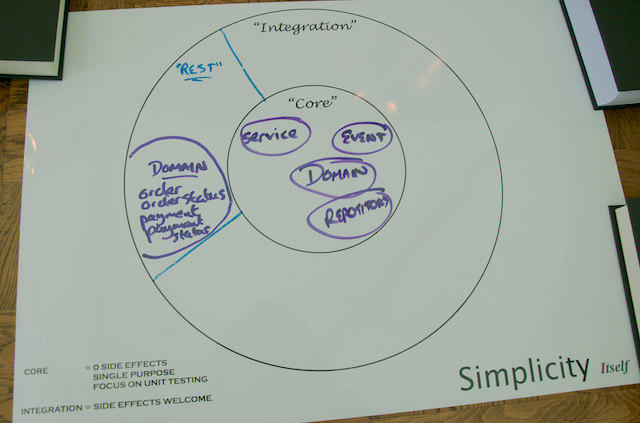

# Step 1: Modelling the Core and RESTful Web Service Domains

For the first version of your new Yummy Noodle Bar RESTful service, the ability to create, update, and remove Orders is the focus.

It is tempting simply to expose the Core Order domain to the outside world and work from there, but that would ignore the boundary between the Core and the RESTful service domain and would lead to the REST API being driven by the internal application structure, and so becoming coupled to that internal structure.

The public API of your service (the RESTful service domain) that you will expose to clients needs to change at a rate that is friendly to those clients. The Core needs to evolve at a rate that corresponds to the Yummy Noodle Bar system's need to evolve internally. Potential friction exists between the two domains as they may need to evolve at different rates.

To manage this friction you need to create concepts and components in the RESTful service domain that are unique to, and can evolve at the rate needed by, the RESTful domain itself. This may result in similar types of components to those in the Core domain but because their purpose will be very different, the similarities are superficial.

In the Core domain the concepts are captured as part of the internal ubiquitous language of the application's domain. In the REST domain the concepts are captured as they are used purely for the purpose of exposing the public RESTful interface. 

## Components of the Core application domain for Yummy Noodle Bar


Open the `initial` project. Under `src/main/java/com/yummynoodlebar/core/domain`, you see the components of the core, application-internal domain of Yummy Noodle Bar:

* **Order**. An individual order in the system that has an associated status and status history for tracking purposes.

`src/main/java/com/yummynoodlebar/core/domain/Order.java`
```java
package com.yummynoodlebar.core.domain;

import com.yummynoodlebar.core.events.orders.OrderDetails;
import org.springframework.beans.BeanUtils;

import java.util.*;

public class Order {

  private final Date dateTimeOfSubmission;
  private Map<String, Integer> orderItems;
  private final UUID key;
  private Customer customer;

  private OrderStatus status;
  private List<OrderStatus> statusHistory;

  public Order(final Date dateTimeOfSubmission) {
    this.key = UUID.randomUUID();
    this.dateTimeOfSubmission = dateTimeOfSubmission;
    statusHistory = new ArrayList<OrderStatus>();
  }

  public void addStatus(OrderStatus newStatus) {
    statusHistory.add(newStatus);
    status = newStatus;
  }

  public OrderStatus getStatus() {
    return status;
  }

  public Date getDateTimeOfSubmission() {
    return dateTimeOfSubmission;
  }

  public UUID getKey() {
    return key;
  }

  public void setOrderItems(Map<String, Integer> orderItems) {
    if (orderItems == null) {
      this.orderItems = Collections.emptyMap();
    } else {
      this.orderItems = Collections.unmodifiableMap(orderItems);
    }
  }

  public Map<String, Integer> getOrderItems() {
    return orderItems;
  }

  public boolean canBeDeleted() {
    return true;
  }

  public OrderDetails toOrderDetails() {
    OrderDetails details = new OrderDetails();

    BeanUtils.copyProperties(this, details);

    return details;
  }

  public static Order fromOrderDetails(OrderDetails orderDetails) {
    Order order = new Order(orderDetails.getDateTimeOfSubmission());

    BeanUtils.copyProperties(orderDetails, order);

    return order;
  }
}
```

* **OrderStatus**. Current status allocated to an `Order`.

`src/main/java/com/yummynoodlebar/core/domain/OrderStatus.java`
```java
package com.yummynoodlebar.core.domain;

import com.yummynoodlebar.core.events.orders.OrderStatusDetails;

import java.util.Date;
import java.util.UUID;

public class OrderStatus {

  private Date statusDate;
  private String status;

  public OrderStatus(final Date date, final String status) {
    this.status = status;
    this.statusDate = date;
  }

  public Date getStatusDate() {
    return statusDate;
  }

  public String getStatus() {
    return status;
  }

  public OrderStatusDetails toStatusDetails() {
    return new OrderStatusDetails(statusDate, status);
  }
}
```

* **Payment**. Payment that a customer wants to make for a given `Order`.

`src/main/java/com/yummynoodlebar/core/domain/Payment.java`
```java
package com.yummynoodlebar.core.domain;

public class Payment {
}
```

* **PaymentDetails**. Details of the `Payment` that a customer wants to make for a given `Order`.

`src/main/java/com/yummynoodlebar/core/domain/PaymentDetails.java`
```java
package com.yummynoodlebar.core.domain;

public class PaymentDetails {
}
```

* **PaymentStatus**. Current status of a `Payment` that a customer wants to make for a given `Order`.

`src/main/java/com/yummynoodlebar/core/domain/PaymentStatus.java`
```java
package com.yummynoodlebar.core.domain;

public class PaymentStatus {
}
```

This tutorial focuses on the `Order` domain class, which can be acted upon by a number of events under the `com.yummynoodlebar.events.orders` package as shown on the following diagram:


Events in this case decouple out the domain concepts in the core of the Yummy Noodle Bar application from the various integrations that may need to access and work upon the core. 

The event components associated with Orders include:

* **RequestAllOrdersEvent** and **AllOrdersEvent**. Corresponding events to request the associated OrderDetails about all Orders and the response to that request.

`src/main/java/com/yummynoodlebar/core/events/orders/RequestAllOrdersEvent.java`
```java
package com.yummynoodlebar.core.events.orders;

import com.yummynoodlebar.core.events.RequestReadEvent;

public class RequestAllOrdersEvent extends RequestReadEvent {
}
```
	
`src/main/java/com/yummynoodlebar/core/events/orders/AllOrdersEvent.java`
```java
package com.yummynoodlebar.core.events.orders;

import com.yummynoodlebar.core.events.ReadEvent;

import java.util.Collection;
import java.util.Collections;
import java.util.List;

public class AllOrdersEvent extends ReadEvent {

  private final List<OrderDetails> ordersDetails;

  public AllOrdersEvent(List<OrderDetails> orders) {
    this.ordersDetails = Collections.unmodifiableList(orders);
  }

  public Collection<OrderDetails> getOrdersDetails() {
    return this.ordersDetails;
  }
}
```

* **CreateOrderEvent** and **OrderCreatedEvent**. Corresponding events to request the creation of a new Order, and a confirmation that the new Order has been created.

`src/main/java/com/yummynoodlebar/core/events/orders/CreateOrderEvent.java`
```java
package com.yummynoodlebar.core.events.orders;

import com.yummynoodlebar.core.events.CreateEvent;

public class CreateOrderEvent extends CreateEvent {
  private OrderDetails details;

  public CreateOrderEvent(OrderDetails details) {
    this.details = details;
  }

  public OrderDetails getDetails() {
    return details;
  }
}
```
	
`src/main/java/com/yummynoodlebar/core/events/orders/OrderCreatedEvent.java`
```java
package com.yummynoodlebar.core.events.orders;

import com.yummynoodlebar.core.events.CreatedEvent;

import java.util.UUID;

public class OrderCreatedEvent extends CreatedEvent {

  private final UUID newOrderKey;
  private final OrderDetails details;

  public OrderCreatedEvent(final UUID newOrderKey, final OrderDetails details) {
    this.newOrderKey = newOrderKey;
    this.details = details;
  }

  public OrderDetails getDetails() {
    return details;
  }

  public UUID getNewOrderKey() {
    return newOrderKey;
  }
}
```

* **DeleteOrderEvent** and **OrderDeletedEvent**. Corresponding events to delete an existing Order and then to confirm that the Order has been deleted.

`src/main/java/com/yummynoodlebar/core/events/orders/DeleteOrderEvent.java`
```java
package com.yummynoodlebar.core.events.orders;

import com.yummynoodlebar.core.events.DeleteEvent;

import java.util.UUID;

public class DeleteOrderEvent extends DeleteEvent {

  private final UUID key;

  public DeleteOrderEvent(final UUID key) {
    this.key = key;
  }

  public UUID getKey() {
    return key;
  }
}
```
	
`src/main/java/com/yummynoodlebar/core/events/orders/OrderDeletedEvent.java`
```java
package com.yummynoodlebar.core.events.orders;

import com.yummynoodlebar.core.events.DeletedEvent;

import java.util.UUID;

public class OrderDeletedEvent extends DeletedEvent {

  private UUID key;
  private OrderDetails details;
  private boolean deletionCompleted;

  private OrderDeletedEvent(UUID key) {
    this.key = key;
  }

  public OrderDeletedEvent(UUID key, OrderDetails details) {
    this.key = key;
    this.details = details;
    this.deletionCompleted = true;
  }

  public UUID getKey() {
    return key;
  }

  public OrderDetails getDetails() {
    return details;
  }

  public boolean isDeletionCompleted() {
    return deletionCompleted;
  }

  public static OrderDeletedEvent deletionForbidden(UUID key, OrderDetails details) {
    OrderDeletedEvent ev = new OrderDeletedEvent(key, details);
    ev.entityFound=true;
    ev.deletionCompleted=false;
    return ev;
  }

  public static OrderDeletedEvent notFound(UUID key) {
    OrderDeletedEvent ev = new OrderDeletedEvent(key);
    ev.entityFound=false;
    return ev;
  }
}
```

* **RequestOrderDetailsEvent** and **OrderDetailsEvent**. Corresponding events to request the current details of an Order, and then to receive those details.

`src/main/java/com/yummynoodlebar/core/events/orders/RequestOrderDetailsEvent.java`
```java
package com.yummynoodlebar.core.events.orders;

import com.yummynoodlebar.core.events.RequestReadEvent;

import java.util.UUID;

public class RequestOrderDetailsEvent extends RequestReadEvent {
  private UUID key;

  public RequestOrderDetailsEvent(UUID key) {
    this.key = key;
  }

  public UUID getKey() {
    return key;
  }
}
```
	
`src/main/java/com/yummynoodlebar/core/events/orders/OrderDetailsEvent.java`
```java
package com.yummynoodlebar.core.events.orders;

import com.yummynoodlebar.core.events.ReadEvent;

import java.util.UUID;

public class OrderDetailsEvent extends ReadEvent {
  private UUID key;
  private OrderDetails orderDetails;

  private OrderDetailsEvent(UUID key) {
    this.key = key;
  }

  public OrderDetailsEvent(UUID key, OrderDetails orderDetails) {
    this.key = key;
    this.orderDetails = orderDetails;
  }

  public UUID getKey() {
    return key;
  }

  public OrderDetails getOrderDetails() {
    return orderDetails;
  }

  public static OrderDetailsEvent notFound(UUID key) {
    OrderDetailsEvent ev = new OrderDetailsEvent(key);
    ev.entityFound=false;
    return ev;
  }
}
```

* **RequestOrderStatusEvent** and **OrderStatusEvent**. Corresponding events to request the current status of an Order, and then to receive the current status.

`src/main/java/com/yummynoodlebar/core/events/orders/RequestOrderStatusEvent.java`
```java
package com.yummynoodlebar.core.events.orders;

import com.yummynoodlebar.core.events.RequestReadEvent;

import java.util.UUID;

public class RequestOrderStatusEvent extends RequestReadEvent {
  private UUID key;

  public RequestOrderStatusEvent(UUID key) {
    this.key = key;
  }

  public UUID getKey() {
    return key;
  }
}
```
	
`src/main/java/com/yummynoodlebar/core/events/orders/OrderStatusEvent.java`
```java
package com.yummynoodlebar.core.events.orders;

import com.yummynoodlebar.core.events.ReadEvent;

import java.util.UUID;

public class OrderStatusEvent extends ReadEvent {
  private UUID key;
  private OrderStatusDetails orderStatus;

  private OrderStatusEvent(UUID key) {
    this.key = key;
  }

  public OrderStatusEvent(UUID key, OrderStatusDetails orderStatus) {
    this.key = key;
    this.orderStatus = orderStatus;
  }

  public UUID getKey() {
    return key;
  }

  public OrderStatusDetails getOrderStatus() {
    return orderStatus;
  }

  public static OrderStatusEvent notFound(UUID key) {
    OrderStatusEvent ev = new OrderStatusEvent(key);
    ev.entityFound=false;
    return ev;
  }
}
```

* **SetOrderPaymentEvent**. Triggered when Payment is to be set on an existing Order.

`src/main/java/com/yummynoodlebar/core/events/orders/SetOrderPaymentEvent.java`
```java
package com.yummynoodlebar.core.events.orders;

import com.yummynoodlebar.core.events.UpdateEvent;

import java.util.UUID;

public class SetOrderPaymentEvent extends UpdateEvent {

  private UUID key;
  private PaymentDetails paymentDetails;

  public SetOrderPaymentEvent(UUID key, PaymentDetails paymentDetails) {
    this.key = key;
    this.paymentDetails = paymentDetails;
  }

  public UUID getKey() {
    return key;
  }

  public PaymentDetails getPaymentDetails() {
    return paymentDetails;
  }
}
```

* **OrderUpdatedEvent**. Triggered when an Order is updated.

`src/main/java/com/yummynoodlebar/core/events/orders/OrderUpdatedEvent.java`
```java
package com.yummynoodlebar.core.events.orders;

import com.yummynoodlebar.core.events.UpdatedEvent;

import java.util.UUID;

public class OrderUpdatedEvent extends UpdatedEvent {

  private UUID key;
  private OrderDetails orderDetails;

  public OrderUpdatedEvent(UUID key, OrderDetails orderDetails) {
    this.key = key;
    this.orderDetails = orderDetails;
  }

  public UUID getKey() {
    return key;
  }

  public OrderDetails getOrderDetails() {
    return orderDetails;
  }
}
```
	

## Model the orders and order resources

There are three stages to modeling your RESTful service domain:

* Design your resources. What resources do you need to expose to the outside world?
* Design your URIs. How will your resources be publicly addressed?
* Add operations. What operations can you perform on your RESTfully exposed resources?

### Design your resources

To determine the resources that you will support through your RESTful service, look for the relevant nouns in your domain. In the case of the Yummy Noodle Bar, the following nouns are candidates for exposure to the outside world from the core domain:

* Customer
* Order
* OrderStatus
* OrderStatusHistory
* Payment
* PaymentDetails
* PaymentStatus

The purpose of the Yummy Noodle RESTful service is to allow aggregators and partners to submit and track orders as they are executed and delivered from the Yummy Noodle Bar. Therefore, we don't need to expose the entirety of these domain concepts via REST. Instead we can take the following subset:

* Order
* OrderStatus
* PaymentDetails
* PaymentStatus

The updated life preserver shows where these domain components will live in the design.


As mentioned before, although these concepts exist in both the Core domain and the RESTful Service domain, this is not duplication as the purpose of the implementations are very different from Core to REST.

### Design your resource URIs

While these resources will be represented by a class in code, you must first decide the REST API, as this will drive the design of the code that implements the API and so the implementation of the resources.

Each resource needs to be addressable by a URI. In addition, the address implies the relationship between each of the resources.

For your Yummy Noodle Bar RESTful Service domain, the resources will have the following URIs:

* All Orders

        http://www.yummynoodlebar.com/aggregators/orders

* One `Order`

        http://www.yummynoodlebar.com/aggregators/orders/{Order ID}

* Current `OrderStatus` for one `Order`

        http://www.yummynoodlebar.com/aggregators/orders/{Order ID}/status

* `PaymentDetails` for one `Order`

        http://www.yummynoodlebar.com/aggregators/orders/{Order ID}/paymentdetails

* `PaymentStatus` for one `Order`

        http://www.yummynoodlebar.com/aggregators/orders/{Order ID}/paymentstatus

#### URI templates

Each of the above URIs are expressed as *templates*; they contain blocks demarcated with {} in the URI. Because the URI in a RESTful service should completely address the resource, without any additional query parameters, parts of the URI are specific to the resource itself.  

For example, here the {} notation specifies where an Order with Order ID of 1 would have the following specific URL once the URI template is furnished with the Order Number:

    http://www.yummynoodlebar.com/aggregators/orders/1

An Order with an Order ID of 37 would have the following specific URI:

    http://www.yummynoodlebar.com/aggregators/orders/37

This quality of the URI changing to work with specific resources is what gives a resource the quality of being *addressable*.

### Add the operations (HTTP methods)

Along with the URLs you're going to expose for the RESTful service for each resource, you also need to decide what can be done to each resource.

RESTful services rely on the HTTP methods passed as part of an HTTP request header to tell the service what needs to be done with the addressed resource. The full set of HTTP methods allowed constitute the [uniform interface](http://en.wikipedia.org/wiki/Representational_state_transfer) to RESTful services.

The following methods are supported.

<table>
   <thead>
	<tr>
		<th>HTTP Method</th>
		<th>Description</th>
	</tr>
	</thead>
	<tbody>
	<tr>
		<td>GET</td>
		<td>Retrieves a representation of the resource addressed by the URI used to submit the HTTP request upon.</td>
	</tr>
	<tr>
		<td>POST</td>
		<td>Creates a new resource under the URI used to submit the POST HTTP Request upon.</td>
	</tr>
	<tr>
		<td>PUT</td>
		<td>Updates the resource indicated by the URI used to submit the HTTP request upon. If a resource did not already exist at the specified URI, then a new resource at the specified address will be created.</td>
	</tr>
	<tr>
		<td>DELETE</td>
		<td>Removes the resource from the system where it is addressed by the URI used to submit the HTTP request upon.</td>
	</tr>
	<tr>
		<td>HEAD and OPTIONS</td>
		<td>Retrieve various meta-data about the resource addressed by the URI used to submit the HTTP request upon.</td>
	</tr>
	</tbody>
</table>

The HTTP 1.1 Specification provides a detailed description of all the HTTP Methods.

POST and PUT have similar but not identical functions. You use POST to create new entities without knowing the final URI, and use PUT to create and update entities in a previously known URI.

The following table describes what HTTP methods will be supported for each supported resource address.

<table>
    <thead>
	<tr>
		<th>Resource URI</th>
		<th>Supported HTTP Methods</th>
		<th>Description</th>
	</tr>
	</thead>
	<tbody>
	<tr>
		<td>/aggregators/orders</td>
		<td>GET</td>
		<td>Asks for a representation of all of the orders.</td>
	</tr>
	<tr>
		<td>/aggregators/orders</td>
		<td>POST</td>
		<td>Attempt to create a new order, returning the location (in the Location HTTP Header) of the newly created resource.</td>
	</tr>
	<tr>
		<td>/aggregators/orders/{id}</td>
		<td>GET</td>
		<td>Asks for a representation of a specific Order resource.</td>
	</tr>
	<tr>
		<td>/aggregators/orders/{id}</td>
		<td>DELETE</td>
		<td>Requests the deletion of a specified Order resource.</td>
	</tr>
	<tr>
		<td>/aggregators/order/{id}/status</td>
		<td>GET</td>
		<td>Asks for a representation of a specific Order's current status.</td>
	</tr>
	<tr>
		<td>/aggregators/order/{id}/paymentdetails</td>
		<td>GET</td>
		<td>Asks for a representation of a specific Order's payment details resource.</td>
	</tr>
	<tr>
		<td>/aggregators/order/{id}/paymentdetails</td>
		<td>PUT</td>
		<td>Updates a specific Order's payment details resource.</td>
	</tr>
	</tbody>
</table>


## Capture status codes

No RESTful design is complete without considering responses to requests. Now you need to capture the [HTTP Status Codes](http://www.w3.org/Protocols/rfc2616/rfc2616-sec10.html) your service will respond with for a given combination of URI and HTTP method on a request.

The following table describes the HTTP status codes that each of your URIs and HTTP method combinations will respond with.

<table>
    <thead>
	<tr>
		<th>Resource URI</th>
		<th>Supported HTTP Methods</th>
		<th>Supported HTTP Status Codes</th>
	</tr>
	</thead>
	<tbody>
	<tr>
		<td>/aggregators/orders</td>
		<td>GET</td>
		<td>200 (OK, Success)</td>
	</tr>
	<tr>
		<td>/aggregators/orders</td>
		<td>POST</td>
		<td>201 (Created) if the Order resource is successfully created, in addition to a Location header that contains the link to the newly created Order resource; 406 (Not Acceptable) if the format of the incoming data for the new resource is not valid</td>
	</tr>
	<tr>
		<td>/aggregators/orders/{id}</td>
		<td>GET</td>
		<td>Asks for a representation of a specific Order resource.</td>
	</tr>
	<tr>
		<td>/aggregators/orders/{id}</td>
		<td>DELETE</td>
		<td>200 (OK); 404 (Not Found) if Order Resource not found</td>
	</tr>
	<tr>
		<td>/aggregators/orders/{id}/status</td>
		<td>GET</td>
		<td>200 (OK); 404 (Not Found) if Order Resource not found</td>
	</tr>
	<tr>
		<td>/aggregators/orders/{id}/paymentdetails</td>
		<td>GET</td>
		<td>200 (OK); 404 (Not Found) if Order Resource not found</td>
	</tr>
	<tr>
		<td>/aggregators/orders/{id}/paymentdetails</td>
		<td>PUT</td>
		<td>201 (Created); 406 (Not Acceptable) if there is a problem with the format of the incoming data on the new payment details; 404 (Not Found) if Order Resource not found</td>
	</tr>
	</tbody>
</table>

## Summary

Congratulations! You've determined the resources you're going to expose and captured those in the REST domain as shown in the following Life Preserver:



You've also decided the URI addresses of your resources; the HTTP methods that will be supported for requests to those URIs; and finally the HTTP status codes that you intend to return for the requests.

We haven't run any code yet. That's what we'll do in the next section, when we build some services and tests.

[Next… Building Your First RESTful Service](../2/) 