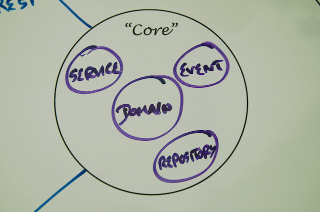
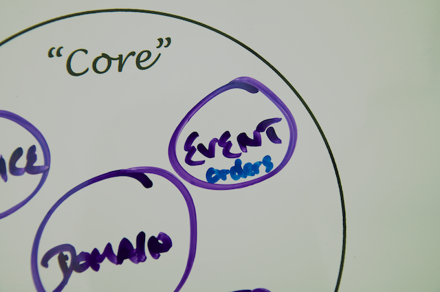

## Step 1: Modelling the RESTful Service Domain

Opening up the 'initial' project you'll be able to see that under src/main/java/com/yummynoodlebar the core, application-internal domain of the Yummy Noodle Bar is made up of the following components:

* **Order**

    An individual order in the system that has an associated status and status history for tracking purposes.

* **OrderStatus**

    The current allocated status to an order.

* **Payment**

    The Payment that a customer wants to make for a given Order.

* **PaymentDetails**

    The Details of the Payment that a customer wants to make for a given Order.

* **PaymentStatus**

    The current status of a Payment that a customer wants to make for a given Order.

Focussing for this tutorial on the Order domain classes, these can be acted upon by a number of events under the com.yummynoodlebar/events/orders package as shown on the following diagram:

Events in this case decouple out the domain concepts in the core  of the Yummy Noodle Bar application from the various integrations that may need to access and work upon the core. 

The event components associated with Orders include:

* **RequestAllOrdersEvent** and **AllOrdersEvent** 

    Corresponding events to request the associated OrderDetails about all Orders and the response to that request.

* **CreateOrderEvent** and **OrderCreatedEvent**

    Corresponding events to request the creation of a new Order, and a confirmation that the new Order has been created.

* **DeleteOrderEvent** and **OrderDeletedEvent**

    Corresponding events to delete an existing Order and then to confirm that the Order has been deleted.

* **RequestOrderDetailsEvent** and **OrderDetailsEvent**

    Corresponding events to request the current details of an Order, and then to receive those details.

* **RequestOrderStatusEvent** and **OrderStatusEvent**

    Corresponding events to request the current status of an Order, and then to receive the current status.

* **SetOrderPaymentEvent**

    Event is triggered when Payment is to be set on an existing Order.

* **OrderUpdatedEvent** 

    Event is triggered when an Order is updated.

## Modelling the RESTful Service Domain

For the first version of your new Yummy Noodle Bar RESTful service, the ability to create, update and remove Orders is the focus.

It can be tempting to simply expose the core Order domain to the outside world and work from there, but that would ignore the boundary between the Core and the RESTful service domain.

The public API of your service that you are going to expose to the aggregators will need to change at a rate that is friendly to those clients, and the core will need to evolve at whatever rate the Yummy Noodle bar system need to internally evolve at. So there is potentially friction between the two domains as they may need to evolve at different rates.

To manage this friction you need to create concepts and components in the RESTful Service domain that are unique to, and can evolve at the rate needed by, the RESTful domain itself. This may result in similar types of components but since their purpose will be very different the similarities are superficial.

## Modelling the Orders and Order Resources

There are three stages to modelling your RESTful Service domain, they are:

* Designing your Resources - What resources you need to expose to the outside world
* Designing your URIs - How your resources will be publicly addressed
* Adding the verbs - what operations can you perform on your RESTfully exposed resources

### Designing your Resources

When looking for the resources that you are going to support through your RESTful Service the first step is to look for the relevant nouns in your domain. In the case of the Yummy Noodle Bar, the following nouns are candidates for exposure to the outside world from the core domain:

* Customer
* Order
* OrderStatus
* OrderStatusHistory
* Payment
* PaymentDetails
* PaymentStatus

The purpose of the Yummy Noodle Restful Service is to allow aggregators and partners to submit and track orders as they are executed and delivered from the Yummy Noodle Bar. To do this a subset of the available domain concepts make up your initial cut of the resources you are going to expose:

* Order
* OrderStatus
* PaymentDetails
* PaymentStatus

The following updated Life Preserver shows these domain components and where they live in the design.

As mentioned before, although these concepts existing in the Core domain and the REST Domain, this is not exactly repetition as the purpose of the implementations are very different from Core to REST.

In the Core Domain the concepts are captured as part of the internal ubiquitous language of the application's domain. In the REST domain the concepts are captured as they are used purely for the purpose of exposing the public RESTful interface. 

### Designing your Resources - URIs

Each resource needs to be addressable using a URI. In addition, the address implies the relationship between each of the resources.

For your Yummy Noodle Bar RESTful Service domain, the resources will have the following URIs:

* All Orders

        http://www.yummynoodlebar.com/aggregators/orders

* An Order

        http://www.yummynoodlebar.com/aggregators/orders/{Order ID}

* The current OrderStatus

        http://www.yummynoodlebar.com/aggregators/orders/{Order ID}/status

* The PaymentDetails for an Order

        http://www.yummynoodlebar.com/aggregators/orders/{Order ID}/paymentdetails

* PaymentStatus

        http://www.yummynoodlebar.com/aggregators/orders/{Order ID}/paymentstatus

### Introducing URI Templates

Each of the above URI's are expressed as *templates*; they contain blocks demarcated with {} in the URI. Since the URI in a RESTful service should completely address the resource, without any additional query parameters, then there will be parts of the URI that are specific to the resource itself. An example would be 

Here we've used the {} notation to specify where part of the URL will be unique when identifying specific resources. As an example, an Order with Order ID of 1 would have the following specific URL once the URI template is furnished with the Order Number:

    http://www.yummynoodlebar.com/aggregators/order/1

An Order with an Order ID of 37 would have the following specific URI:

    http://www.yummynoodlebar.com/aggregators/order/37

This quality of the URI changing to work with specific resources is what gives a resource the quality of being *addressable*.

### Adding the verbs - HTTP Methods

Along with the URLs you're going to expose for the RESTful service for each of the resources, you also need to specify what can be done to each of those resources.

RESTful services rely on the HTTP methods passed as part of an HTTP request header to inform the service what needs to be done with the addressed resource. The full set of HTTP methods allowed comprise the [uniform interface](http://en.wikipedia.org/wiki/Representational_state_transfer) to RESTful services.

There are a number of methods supported as shown in the following table:

<table>
    <tr>
        <td>GET</td>
			  <td>Retrieves a representation of the resource addressed by the URI used to submit the HTTP request upon.</td>
	  </tr>
<tr>
				<td>POST</td>
			  <td>Creates a new resource under the URI used to submit the POST HTTP Request upon.</td>
</tr>
<tr>
				<td>PUT</td>
			  <td>Updates the resource indicated by the URI used to submit the HTTP request upon. If a resource did not already exist at the specified URI, then a new resource at the specified address will be created.</td>
</tr>
<tr>
        <td>DELETE</td>
			  <td>Removes the resource from the system where it is addressed by the URI used to submit the HTTP request upon.</td>
</tr>
<tr>
        <td>HEAD and OPTIONS</td>
			  <td>Retrieved various meta-data about the resource addressed by the URI used to submit the HTTP request upon.</td>
    </tr>
</table>

A full land detailed description of all of the HTTP Methods is provided by the HTTP 1.1 Specification.

There can be some confusion when you take a closer look at POST and PUT, on initial reflection they look to do something very similar, which they do but they both have their own individual place and valuable role to perform. 

POST is used to create new entities without knowing the final URI, and PUT is used to create and update entities in a previously known URI.

The following table describes what HTTP Methods will be supported for each of the resources addresses supported:

<table>
    <tr>
    <th>Resource URI</th>
    <th>Supported HTTP Methods</th>
    <th>Description</th>
</tr>
    <tr>
        <td>/aggregators/orders</td>
			  <td>GET</td>
        <td>Asks for a representation of all of the orders.</td>
	  </tr>
    <tr>
        <td>/aggregators/orders</td>
			  <td>POST</td>
        <td>Attempt to create a new order, returning the location (in the Location HTTP Header) of the newly created resource.</td>
	  </tr>
	  <tr>
        <td>/aggregators/orders/{id}</td>
			  <td>GET</td>
        <td>Asks for a representation of a specific Order resource.</td>
	  </tr>
<tr>
        <td>/aggregators/orders/{id}</td>
			  <td>DELETE</td>
        <td>Requests the deletion of a specified Order resource.</td>
	  </tr>
<tr>
        <td>/aggregators/order/{id}/status</td>
			  <td>GET</td>
        <td>Asks for a representation of a specific Order's current status.</td>
	  </tr>
<tr>
        <td>/aggregators/order/{id}/paymentdetails</td>
			  <td>GET</td>
        <td>Asks for a representation of a specific Order's payment details resource.</td>
	  </tr>
<tr>
        <td>/aggregators/order/{id}/paymentdetails</td>
			  <td>PUT</td>
        <td>Updates a specific Order's payment details resource.</td>
	  </tr>
</table>

## Understanding Status Codes

No RESTful design would be complete without considering the responses to the HTTP requests as designed up to this point. 

So far you've designed what resources you are going to expose, the URI addresses of those resources and the HTTP methods that are supported on each of those URIs. The final piece of the puzzle is capturing what [HTTP Status Codes](http://www.w3.org/Protocols/rfc2616/rfc2616-sec10.html) your service will respond with for a given combination of URI and HTTP Method on a request.

The following table describes the HTTP Status Codes that each of your URIs and HTTP Method combinations will respond with.

<table>
    <tr>
    <th>Resource URI</th>
    <th>Supported HTTP Methods</th>
    <th>Supported HTTP Status Codes</th>
</tr>
    <tr>
        <td>/aggregators/orders</td>
			  <td>GET</td>
        <td>200 (OK, Success)</td>
	  </tr>
    <tr>
        <td>/aggregators/orders</td>
			  <td>POST</td>
        <td>201 (Created) if the Order resource is successfully created, in addition to a Location header that contains the link to the newly created Order resource; 406 (Not Acceptable) if the format of the incoming data for the new resource is not valid</td>
	  </tr>
	  <tr>
        <td>/aggregators/orders/{id}</td>
			  <td>GET</td>
        <td>Asks for a representation of a specific Order resource.</td>
	  </tr>
<tr>
        <td>/aggregators/orders/{id}</td>
			  <td>DELETE</td>
        <td>200 (OK); 404 (Not Found) if Order Resource not found</td>
	  </tr>
<tr>
        <td>/aggregators/order/{id}/status</td>
			  <td>GET</td>
        <td>200 (OK); 404 (Not Found) if Order Resource not found</td>
	  </tr>
<tr>
        <td>/aggregators/order/{id}/paymentdetails</td>
			  <td>GET</td>
        <td>200 (OK); 404 (Not Found) if Order Resource not found</td>
	  </tr>
<tr>
        <td>/aggregators/order/{id}/paymentdetails</td>
			  <td>PUT</td>
        <td>201 (Created); 406 (Not Acceptable) if there is a problem with the format of the incoming data on the new payment details; 404 (Not Found) if Order Resource not found</td>
	  </tr>
</table>

## Summary

So now you have a design for the resources you're going to expose, the URI addresses of those resources, the HTTP Methods that will be supported for requests to those URIs and finally the sorts of HTTP Status Codes that you intend to return for those requests.

Now it's time to get your hands dirty with implementing your RESTful service using Spring!

[Next… Building Your First RESTful Service](../2/) 