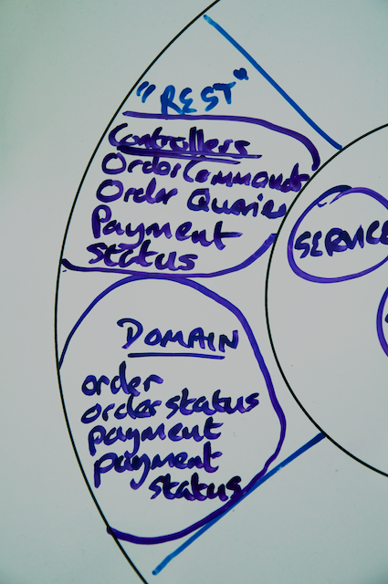

# Step 2: Building Your First RESTful Web Service with Spring MVC

It's time to implement your Yummy Noodle Bar RESTful web service. The first step in building a service with Spring MVC is to construct and test one or more controllers that are responsible for handling each incoming HTTP request that you defined for your service in the previous step.

## Start with a (failing) test

[Test Driven Development (TDD)]() teaches us that if you haven't got a failing test then there's no code to write! So before you dive into implementing the service, create a couple of tests that justify and encourage you to write some code to make the test pass.

### Separate commands from queries

Before you start creating tests, consider the categories of requests that your service will respond to. You are going to be writing tests that look for all the HTTP RESTful interactions that you designed in Step 1.

These interactions can be split into X categories:

* Requests that read, or query, the current state of an Order
* Requests that change the state of a new or existing Order
* Requests that read an Order's status
* Requests that query Payment Details
* Requests that change the state of an Order's Payment Details

You can separate these interactions into two categories:

* Requests that change a resource's state (a Command)
* Requests that query a resource's state (a Query)

It's possible to implement these two categories of interactions using one controller for each resource. However, the [Command Query Responsibility Segregation (CQRS)](http://martinfowler.com/bliki/CQRS.html) pattern advises you to split these responsibilities into different routes through your application. In this tutorial you implement these concerns separately.

### Implement failing test(s) for a controller with MockMVC

You won't implement all tests needed for your RESTful service here; the full source is available for download separately. Instead you use two unit tests that look for an example of each category of interaction through the RESTful service, commands, and queries.

#### Test GET HTTP method HTTP requests

The first test ensures that a request to view an order's details is possible, so call the class `ViewOrderIntegrationTest`.

	public class ViewOrderIntegrationTest {

Why an integration test? Because you're going to be testing the controller within the constraints of a mock Spring MVC environment. This way you can test the mappings of your incoming requests to the appropriate handler methods while still getting the speed benefits of testing a real container.

Next, add an instance of `MockMvc` to the test class and set up a mock controller and `OrderService`.

public class ViewOrderIntegrationTest {

  	MockMvc mockMvc;

  	@InjectMocks
  	OrderQueriesController controller;

  	@Mock
  	OrderService orderService;

  	UUID key = UUID.fromString("f3512d26-72f6-4290-9265-63ad69eccc13");

  	@Before
  	public void setup() {
    	MockitoAnnotations.initMocks(this);

    	this.mockMvc = standaloneSetup(controller)
            .setMessageConverters(new MappingJackson2HttpMessageConverter()).build();
  	}

In the `@Before` annotated `setup()` method, you set up Mockito and generate a mock Spring MVC environment, including adding JSON message conversion, because you expect JSON when you ask for the current state of an Order.

MockMVC is a relatively new part of Spring MVC and gives a method to fully test a Controller, including all of its annotations, routing, and URI templates.  It does this by initializing the MVC Controller classes in a full MVC environment, including the DispatcherServlet and then running assertions against that.  The only piece missing from this testing puzzle is the web context itself, which is covered in Step 4.

Finally you can implement a test method that performs an HTTP Request on the controller and asserts that the response from that invocation contains the JSON that was requested.

	@Test
  	public void thatViewOrderRendersCorrectly() throws Exception {

	  when(orderService.requestOrderDetails(any(RequestOrderDetailsEvent.class))).thenReturn(
            orderDetailsEvent(key));

    	this.mockMvc.perform(
            get("/aggregators/orders/{id}", key.toString())
                    .accept(MediaType.APPLICATION_JSON))
            .andExpect(jsonPath("$.items['" + YUMMY_ITEM + "']").value(12))
            .andExpect(jsonPath("$.key").value(key.toString()));
  	}

Now look at the final call in the above method, the usage of `MockMVC`, in a little more detail.

The `mockMvc` object is performing the following tasks, in sequence:

* Performing a mock HTTP Request with a GET HTTP Method on the URI /aggregators/orders/{id}.
* Replacing the {id} marker in the URI template with the contents of the response to the key.toString() call.
* Specifying in the 'accept' HTTP Header that the service should respond with JSON.
* Analyzing the content of the returned JSON to ensure that some mocked data is present, as provided by the mock collaborators that were set up at the start of the test method.

The Spring MockMVC component makes it possible to do this testing where you can be sure that for a given URI, a given rendered content in the response will be returned, all executed in a unit test from within your IDE or Continuous Integration environments.

The full set implementation of the `ViewOrderIntegrationTest` is shown below:

	package com.yummynoodlebar.rest.controller;

	import com.yummynoodlebar.core.events.orders.RequestOrderDetailsEvent;
	import com.yummynoodlebar.core.services.OrderService;
	import org.junit.Before;
	import org.junit.Test;
	import org.mockito.InjectMocks;
	import org.mockito.Mock;
	import org.mockito.MockitoAnnotations;
	import org.springframework.http.MediaType;
	import org.springframework.http.converter.json.MappingJackson2HttpMessageConverter;
	import org.springframework.test.web.servlet.MockMvc;

	import java.util.UUID;

	import static org.mockito.Mockito.any;
	import static org.mockito.Mockito.when;
	import static org.springframework.test.web.servlet.request.MockMvcRequestBuilders.get;
	import static org.springframework.test.web.servlet.result.MockMvcResultHandlers.print;
	import static org.springframework.test.web.servlet.result.MockMvcResultMatchers.*;
	import static org.springframework.test.web.servlet.setup.MockMvcBuilders.standaloneSetup;
	import static com.yummynoodlebar.rest.controller.fixture.RestDataFixture.*;
	import static com.yummynoodlebar.rest.controller.fixture.RestEventFixtures.*;

	public class ViewOrderIntegrationTest {

  	MockMvc mockMvc;

  	@InjectMocks
  	OrderQueriesController controller;

  	@Mock
  	OrderService orderService;

  	UUID key = UUID.fromString("f3512d26-72f6-4290-9265-63ad69eccc13");

  	@Before
  	public void setup() {
    	MockitoAnnotations.initMocks(this);

    	this.mockMvc = standaloneSetup(controller)
            .setMessageConverters(new MappingJackson2HttpMessageConverter()).build();
  	}

  	@Test
  	public void thatViewOrderUsesHttpNotFound() throws Exception 	{

    	when(orderService.requestOrderDetails(any(RequestOrderDetailsEvent.class))).thenReturn(
            orderDetailsNotFound(key));

    	this.mockMvc.perform(
            get("/aggregators/orders/{id}",  key.toString())
                    .accept(MediaType.APPLICATION_JSON))
            .andDo(print())
            .andExpect(status().isNotFound());
  	}

  	@Test
  	public void thatViewOrderUsesHttpOK() throws Exception {

    	when(orderService.requestOrderDetails(any(RequestOrderDetailsEvent.class))).thenReturn(
            orderDetailsEvent(key));

    	this.mockMvc.perform(
            get("/aggregators/orders/{id}", key.toString())
                    .accept(MediaType.APPLICATION_JSON))
            .andExpect(status().isOk());
  	}

  	@Test
  	public void thatViewOrderRendersCorrectly() throws Exception {

    	when(orderService.requestOrderDetails(any(RequestOrderDetailsEvent.class))).thenReturn(
            orderDetailsEvent(key));

    	this.mockMvc.perform(
            get("/aggregators/orders/{id}", key.toString())
                    .accept(MediaType.APPLICATION_JSON))
            .andExpect(jsonPath("$.items['" + YUMMY_ITEM + "']").value(12))
            .andExpect(jsonPath("$.key").value(key.toString()));
  	}
	}

#### Test DELETE HTTP method HTTP requests

Take a look at a test implemented in exactly the same fashion, but performing the job of canceling an Order by sending a HTTP request with a DELETE HTTP method to the Order's URI (the full code for this can be found in the `CancelOrderIntegrationTest` test class):

  	@Test
  	public void thatDeleteOrderUsesHttpOkOnSuccess() throws Exception {

    	when(orderService.deleteOrder(any(DeleteOrderEvent.class)))
            .thenReturn(orderDeleted(key));

    	this.mockMvc.perform(
            delete("/aggregators/orders/{id}", key.toString())
                    .accept(MediaType.APPLICATION_JSON))
            .andDo(print())
            .andExpect(status().isOk());

    	verify(orderService).deleteOrder(argThat(
            Matchers.<DeleteOrderEvent>hasProperty("key",
                    Matchers.equalTo(key))));
  	}

The main difference with this test is that no content is returned from the mock HTTP Request performed using `mockMvc`. Instead you are using Mockito's verify behavior to ensure that your controller is making the appropriate `deleteOrder` call to the mock `orderService` in order for the test to pass.

The full implementation of all the command-oriented (i.e. changes a resource's state) tests captured in `CancelOrderIntegrationTest` is shown below:

	package com.yummynoodlebar.rest.controller;

	import com.yummynoodlebar.core.events.orders.DeleteOrderEvent;
	import com.yummynoodlebar.core.services.OrderService;
	import org.hamcrest.Matchers;
	import org.junit.Before;
	import org.junit.Test;
	import org.mockito.InjectMocks;
	import org.mockito.Mock;
	import org.mockito.MockitoAnnotations;
	import org.springframework.http.MediaType;
	import org.springframework.http.converter.json.MappingJackson2HttpMessageConverter;
	import org.springframework.test.web.servlet.MockMvc;

	import java.util.UUID;

	import static com.yummynoodlebar.rest.controller.fixture.RestEventFixtures.*;
	import static org.mockito.Mockito.*;
	import static org.mockito.Mockito.when;
	import static org.springframework.test.web.servlet.request.MockMvcRequestBuilders.delete;
	import static org.springframework.test.web.servlet.result.MockMvcResultHandlers.print;
	import static org.springframework.test.web.servlet.result.MockMvcResultMatchers.*;
	import static org.springframework.test.web.servlet.setup.MockMvcBuilders.standaloneSetup;

	public class CancelOrderIntegrationTest {

  	MockMvc mockMvc;

  	@InjectMocks
  	OrderCommandsController controller;

  	@Mock
  	OrderService orderService;

  	UUID key = UUID.fromString("f3512d26-72f6-4290-9265-63ad69eccc13");

  	@Before
  	public void setup() {
    MockitoAnnotations.initMocks(this);

    	this.mockMvc = standaloneSetup(controller)
            .setMessageConverters(new MappingJackson2HttpMessageConverter()).build();

  	}

  	@Test
  	public void thatDeleteOrderUsesHttpOkOnSuccess() throws Exception {

    	when(orderService.deleteOrder(any(DeleteOrderEvent.class)))
            .thenReturn(
                    orderDeleted(key));

    	this.mockMvc.perform(
            delete("/aggregators/orders/{id}", key.toString())
                    .accept(MediaType.APPLICATION_JSON))
            .andDo(print())
            .andExpect(status().isOk());

    	verify(orderService).deleteOrder(argThat(
            Matchers.<DeleteOrderEvent>hasProperty("key",
                    Matchers.equalTo(key))));
  	}

  	@Test
  	public void thatDeleteOrderUsesHttpNotFoundOnEntityLookupFailure() throws Exception {

    	when(orderService.deleteOrder(any(DeleteOrderEvent.class)))
            .thenReturn(
                    orderDeletedNotFound(key));

    	this.mockMvc.perform(
            delete("/aggregators/orders/{id}", key.toString())
                    .accept(MediaType.APPLICATION_JSON))
            .andDo(print())
            .andExpect(status().isNotFound());

  	}

  	@Test
  	public void thatDeleteOrderUsesHttpForbiddenOnEntityDeletionFailure() throws Exception {

    	when(orderService.deleteOrder(any(DeleteOrderEvent.class)))
            .thenReturn(
                    orderDeletedFailed(key));

   	 this.mockMvc.perform(
            delete("/aggregators/orders/{id}", key.toString())
                    .accept(MediaType.APPLICATION_JSON))
            .andDo(print())
            .andExpect(status().isForbidden());
  	  }
	}

#### Test POST HTTP method HTTP requests for creating resources

Take a look at how to test HTTP requests that contain POST as the HTTP method. Specifically, a POST creates a new resource and *generates a new URI for that new resource*, and so this URI generation also needs to be part of the test.

Open the `CreateNewOrderIntegrationTest` class and you should see the following method:

	@Test
  	public void thatCreateOrderPassesLocationHeader() throws Exception {

    	this.mockMvc.perform(
            post("/aggregators/orders")
                    .content(standardOrderJSON())
                    .contentType(MediaType.APPLICATION_JSON)
                    .accept(MediaType.APPLICATION_JSON))
            .andExpect(header().string("Location", Matchers.endsWith("/aggregators/order/f3512d26-72f6-4290-9265-63ad69eccc13")));
  	}
 
The focus here is on the `andExpect` condition at the end of the `perform` call to `mockMvc`. Here you're testing that the response of the `post` has resulted in a new `Location` HTTP header and that it contains a URI that is of the form expected, given the posted new Order content.

Now look at the remaining test implementations in the tutorial sample project so you can see how the rest of the tests for your RESTful interface is implemented. Of course at this point those tests will fail as you haven't created any corresponding controllers.

## Make the tests pass: implement the controllers

You now have a collection of test classes that will fail, given that no controllers exist yet to respond to the mocked HTTP requests.

Now it's time to focus on making the `ViewOrderIntegrationTest`, `CancelOrderIntegrationTest` and `CreateNewOrderIntegrationTest`  tests pass. 

### Implement the OrderQueriesController

Start by implementing the controller that is responsible for handling requests that simply read the current state of the Order resources. This controller will make the `ViewOrderIntegrationTest` tests pass.

Map the root URI to the controller as shown in the following code snippet:

	@Controller
	@RequestMapping("/aggregators/orders")
	class OrderQueriesController {

The `ViewOrdersIntegrationTest` is specifically looking to test requests that are sent to /aggregators/orders/{id} and so you need to implement a controller handler method that will service those requests as shown below:

	@RequestMapping(method = RequestMethod.GET, value = "/{id}")
    	public ResponseEntity<Order> viewOrder(@PathVariable String id) {

        	OrderDetailsEvent details = orderService.requestOrderDetails(new RequestOrderDetailsEvent(UUID.fromString(id)));

        	if (!details.isEntityFound()) {
            	return new ResponseEntity<Order>(HttpStatus.NOT_FOUND);
        	}

        	Order order = Order.fromOrderDetails(details.getOrderDetails());

        	return new ResponseEntity<Order>(order, HttpStatus.OK);
    	}

Notice how a controller handler method implementation is kept very clean as all interactions with the underlying system occur via firing events into the core domain. It is a reasonable design goal to avoid business logic in your controllers and delegate that responsibility to a collaborating component.

As you can see from the `@RequestMapping` annotation, the `viewOrder` handler method is mapped to a URI that is constructed from a combination of the controller's default URI, /aggregator/orders, combined with the template parameter of `{id}` to make the complete mapping for this method /aggregator/orders/{id}.

The `{id}` parameter is then mapped as a String into the `viewOrder` method. Finally, since this is a read-only query request, then `@RequestMapping` also specifies that this method should only be called for HTTP requests with a GET HTTP method.
 
Finally the handler method needs to return the content that the client requests. Rather than add this concern into your controller handler method directly, but using `@ResponseBody`, you can indicate that the objects returned from the method should be marshaled directly into the content that is expected in the response.

Those are all the handler methods you need to directly request information about the current state of your service's Orders as specified by the `ViewOrderIntegrationTest`. The next step is to support that state being manipulated by requests that instigate commands.

### Implement the OrderCommandsController

To implement a handler method for the `CancelOrderIntegrationTest` tests, you create a class called `OrderCommandsController` and map it to the root URL for Order resources /aggregators/orders as shown below.

	@Controller
	@RequestMapping("/aggregators/orders")
	public class OrderCommandsController {

Next you need to implement a method that handles an HTTP request that carried a DELETE HTTP method, targeting a specific Order resource. The following code snippet shows that handler method:

  	    @RequestMapping(method = RequestMethod.DELETE, value = "/{id}")
    	public ResponseEntity<Order> cancelOrder(@PathVariable String id) {

        	OrderDeletedEvent orderDeleted = orderService.deleteOrder(new DeleteOrderEvent(UUID.fromString(id)));

        	if (!orderDeleted.isEntityFound()) {
            return new ResponseEntity<Order>(HttpStatus.NOT_FOUND);
        	}

        	Order order = Order.fromOrderDetails(orderDeleted.getDetails());

        	if (orderDeleted.isDeletionCompleted()) {
            return new ResponseEntity<Order>(order, HttpStatus.OK);
        	}

        	return new ResponseEntity<Order>(order, HttpStatus.FORBIDDEN);
    	}

The `cancelOrder` method needs to deal with conditions in addition to a simple call to see a representation of an Order. Here there's the possibility that there is no Order with the indicated ID.

To vary the response code to a handler method, you use the `ResponseEntity` class. In the example above, the `ResponseEntity` objects afford you the opportunity to return an HTTP Status code of 403 (Forbidden) if an attempt is made to cancel an Order that does not exist.

The `OrderCommandsControler` also needs to deal with the case where a new Order resource is being created using an HTTP request that contains an HTTP POST method.

The following code demonstrates how the POST case can be handled:

	@RequestMapping(method = RequestMethod.POST)
    	public ResponseEntity<Order> createOrder(@RequestBody Order order, UriComponentsBuilder builder) {

        	OrderCreatedEvent orderCreated = orderService.createOrder(new CreateOrderEvent(order.toOrderDetails()));

        	Order newOrder = Order.fromOrderDetails(orderCreated.getDetails());

        	HttpHeaders headers = new HttpHeaders();
        headers.setLocation(
                builder.path("/aggregators/order/{id}")
                        .buildAndExpand(orderCreated.getNewOrderKey().toString()).toUri());

        	return new ResponseEntity<Order>(newOrder, headers, HttpStatus.CREATED);
    	}

The major difference here from the previous controller method implementation is that you're using the `ResponseEntity` return object to also set the HTTP headers. This is necessary as you need to return the newly generated URI for the newly created Order resource.

## Where did the JSON representations come from?

Now when you run the tests in the example project you'll find that they all pass. But wait a second, how did those tests pass when they look for JSON content and you haven't specified how that is being rendered?

In traditional Spring MVC there would be a `ViewResolver` and a specific View to render content for an HTTP response. With a RESTful service, it is much more common to render the returned object from a handler method *as the content itself* and so a view is rarely needed.

The secret of how things are working here is in looking at the dependencies that the project itself has. If you look in the `build.gradle` file in the project's root directory you should see the following entries in the project dependencies:

	runtime 'com.fasterxml.jackson.core:jackson-core:2.2.2'
    runtime 'com.fasterxml.jackson.core:jackson-databind:2.2.2'

These two dependencies are enough for Spring MVC to be able to take classes defined in your RESTful domain that capture the representations that need to be rendered, see the `com.yummynoodlebar.rest.domain` package, and render those objects as JSON according to the content type requested by the client.

This scenario might be new to someone coming from traditional web application development. It is normal in traditional web application development for a browser to send a plethora of possible options as part of the content type negotiation on a given HTTP request. The server will then decide what content to return from that large set of possibilities.

With a RESTful service it is much more typical for a client to ask for exactly what it requires as a content type for a returned representation. Rather than your controller declaring a specific view to render, the Spring MVC content negotiation is invoked according to what content type is requested by the client.

In this test environment, JSON is being requested. But what if another content type is requested? For example, perhaps the client prefers XML?

### Use JAXB to marshall objects into content

Open the `ViewOrderXmlIntegrationTest` class and you should see the following:

	public class ViewOrderXmlIntegrationTest {

  	MockMvc mockMvc;

  	@InjectMocks
  	OrderQueriesController controller;

  	@Mock
  	OrderService orderService;

  	UUID key = UUID.fromString("f3512d26-72f6-4290-9265-63ad69eccc13");

  	  @Before
  	  public void setup() {
    	MockitoAnnotations.initMocks(this);

    	this.mockMvc = standaloneSetup(controller)
            .setMessageConverters(new MappingJackson2HttpMessageConverter(),
                                  new Jaxb2RootElementHttpMessageConverter()).build();
  	  }

  	  @Test
  	  public void thatViewOrderRendersXMLCorrectly() throws Exception {
    	when(orderService.requestOrderDetails(any(RequestOrderDetailsEvent.class))).thenReturn(
            orderDetailsEvent(key));

    	this.mockMvc.perform(
            get("/aggregators/orders/{id}", key.toString())
                    .accept(MediaType.TEXT_XML))
            .andDo(print())
            .andExpect(content().contentType(MediaType.TEXT_XML))
            .andExpect(xpath("/order/key").string(key.toString()));
  	  }

  	  @Test
  	  public void thatViewOrderRendersJsonCorrectly() throws Exception {

    	when(orderService.requestOrderDetails(any(RequestOrderDetailsEvent.class))).thenReturn(
            orderDetailsEvent(key));

    	this.mockMvc.perform(
            get("/aggregators/orders/{id}", key.toString())
                    .accept(MediaType.APPLICATION_JSON))
            .andDo(print())
            .andExpect(content().contentTypeCompatibleWith(MediaType.APPLICATION_JSON))
            .andExpect(jsonPath("$.key").value(key.toString()));
  	  }
	}

This test requests Order representations as JSON and also as XML.

The first thing to notice in the tests is that the `mockMvc` object is being set up to support both XML and JSON. This works only if the appropriate jar files are on the classpath. A glance in `build.gradle` shows the following dependencies to support JAXB2 rendering of XML representations:

	  runtime 'javax.xml.bind:jaxb-api:2.2.9'

All good so far, but XML marshaling from Java objects is a little more involved that JSON. Here you're using JAXB2, and so in addition you'll need to annotate your REST domain classes so that the additional metadata to marshall the right XML is supplied. Take a look inside the `Order` class in `com.yummynoodlebar.rest.domain` for the following example:

	package com.yummynoodlebar.rest.domain;

	import com.yummynoodlebar.core.events.orders.OrderDetails;

	import javax.xml.bind.annotation.XmlRootElement;
	import java.io.Serializable;
	import java.util.Collections;
	import java.util.Date;
	import java.util.Map;
	import java.util.UUID;

	@XmlRootElement
	public class Order implements Serializable {

  	private Date dateTimeOfSubmission;

  	private Map<String, Integer> items;

  	private UUID key;

  	public Date getDateTimeOfSubmission() {
    	return dateTimeOfSubmission;
  	}

  	public UUID getKey() {
    	return key;
  	}

  	public Map<String, Integer> getItems() {
    	return items;
  	}

  	public void setItems(Map<String, Integer> items) {
    	if (items == null) {
      	this.items = Collections.emptyMap();
    	} else {
      	this.items = Collections.unmodifiableMap(items);
    	}
  	}

  	public void setDateTimeOfSubmission(Date dateTimeOfSubmission) {
    	this.dateTimeOfSubmission = dateTimeOfSubmission;
  	}

  	public void setKey(UUID key) {
    	this.key = key;
  	}

  	public OrderDetails toOrderDetails() {
    	OrderDetails details = new OrderDetails();

    	details.setOrderItems(items);
    	details.setKey(key);
    	details.setDateTimeOfSubmission(dateTimeOfSubmission);

    	return details;
  	}

  	public static Order fromOrderDetails(OrderDetails orderDetails) {
    	Order order = new Order();

    	order.dateTimeOfSubmission = orderDetails.getDateTimeOfSubmission();
	   order.key = orderDetails.getKey();
	    order.setItems(orderDetails.getOrderItems());

	    return order;
	  }
	}

## Summary

Congratulations! You've created controllers that can implement your RESTful service's API. You've tested those controllers using 'MockMVC' outside of a container to confirm that the handler mappings work and that your controller will react to the right forms of HTTP requests with the right types of content.

Your Life Preserver now contains a whole new set of components, your controllers, in the RESTful domain:

[Next… Wiring Up and Deploying your Service](../3/)