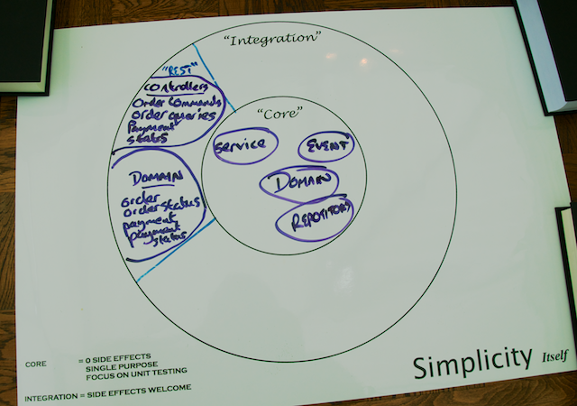
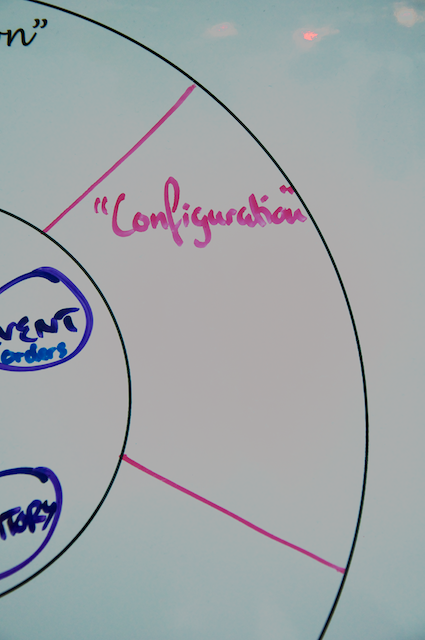
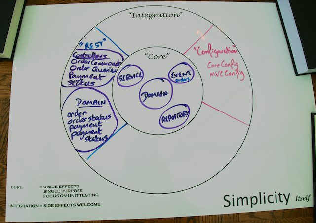

Now that you have [written and tested your controllers](../2/), proudly added to your Life Preserver as shown below, it's time to bring the whole application together.



# Step 3: Configuring and deploying your service

At this point you are ready to:

* Configure the core of your application
* Configure your REST components
* Initialize your RESTful Service's web infrastructure
* Run your RESTful service in a web container

To complete these tasks, you'll need a new domain, the Configuration domain.



## Create a configuration for your application's Core domain using Spring JavaConfig

The Yummy Noodle Bar application contains a core set of components that include domain classes and services.

You could just create a configuration for these components; however, as in the previous step, you'll apply the Test Driven Development approach to your configuration.

### Test your Core configuration

First, construct an integration test that contains the following:

`src/test/java/com/yummynoodlebar/config/CoreDomainIntegrationTest.java`
```java
package com.yummynoodlebar.config;

import com.yummynoodlebar.core.events.orders.AllOrdersEvent;
import com.yummynoodlebar.core.events.orders.CreateOrderEvent;
import com.yummynoodlebar.core.events.orders.OrderDetails;
import com.yummynoodlebar.core.events.orders.RequestAllOrdersEvent;
import com.yummynoodlebar.core.services.OrderService;
import org.junit.Test;
import org.junit.runner.RunWith;
import org.springframework.beans.factory.annotation.Autowired;
import org.springframework.test.context.ContextConfiguration;
import org.springframework.test.context.junit4.SpringJUnit4ClassRunner;

import static junit.framework.TestCase.*;

@RunWith(SpringJUnit4ClassRunner.class)
@ContextConfiguration(classes = {CoreConfig.class})
public class CoreDomainIntegrationTest {

  @Autowired
  OrderService orderService;

  @Test
  public void addANewOrderToTheSystem() {

    CreateOrderEvent ev = new CreateOrderEvent(new OrderDetails());

    orderService.createOrder(ev);

    AllOrdersEvent allOrders = orderService.requestAllOrders(new RequestAllOrdersEvent());

    assertEquals(1, allOrders.getOrdersDetails().size());
  }
}
```

This integration test constructs an `ApplicationContext` using JavaConfig as specified on the `@ContextConfiguration` annotation. The Core domain's configuration will be created using Spring JavaConfig in a class called `CoreConfig`.

With the `ApplicationContext` constructed, the test can have its `OrderService` test entry point autowired, ready for the test methods.

Finally you have one test method that asserts that an `orderService` dependency has been provided and appears to work correctly.

Next, create the Core domain configuration.

### Implement your Core domain configuration

The Core domain configuration for the Yummy Noodle Bar application only contains one service and one dependency that needs to be configured for that service.

The following code shows the complete configuration class:

`src/main/java/com/yummynoodlebar/config/CoreConfig.java`
```java
package com.yummynoodlebar.config;

import com.yummynoodlebar.core.domain.Order;
import com.yummynoodlebar.core.repository.OrdersMemoryRepository;
import com.yummynoodlebar.core.repository.OrdersRepository;
import com.yummynoodlebar.core.services.OrderEventHandler;
import com.yummynoodlebar.core.services.OrderService;
import org.springframework.context.annotation.Bean;
import org.springframework.context.annotation.Configuration;

import java.util.HashMap;
import java.util.UUID;

@Configuration
public class CoreConfig {

  @Bean
  public OrderService createService(OrdersRepository repo) {
    return new OrderEventHandler(repo);
  }

  @Bean
  public OrdersRepository createRepo() {
    return new OrdersMemoryRepository(new HashMap<UUID, Order>());
  }
}
```

Spring JavaConfig will detect each `@Bean` annotated method as a method that generates configured Spring Beans.

Spring will create the `OrdersRepository` bean first, and then use that as the single parameter into the `createService` method to create the `OrderService` bean.

Running the `CoreDomainIntegrationTest` in the `com.yummynoodlebar.config` test package will verify that your Core Domain configuration is good to go.

## Create a configuration for your REST components

Configuring your new set of controllers is very straightforward as you have used `@Controller` on each of the controller classes. To initialize your RESTful domain's components, all you need to do is turn on component scanning so that Spring can find and initialize these Spring beans.

### Implement your RESTful domain configuration

You can create the following Spring JavaConfig to execute component scanning for the components in your application's RESTful domain:

`src/main/java/com/yummynoodlebar/config/MVCConfig.java`
```java
package com.yummynoodlebar.config;

import org.springframework.context.annotation.ComponentScan;
import org.springframework.context.annotation.Configuration;
import org.springframework.web.servlet.config.annotation.EnableWebMvc;

@Configuration
@EnableWebMvc
@ComponentScan(basePackages = {"com.yummynoodlebar.rest.controller"})
public class MVCConfig {}
```

The `@ComponentScan` attribute in JavaConfig specifies that your components should be found underneath the base Java package of `com.yummynoodlebar.rest.controllers`. 

> **Note:** It's always a good idea to be as specific as possible when defining the place where component scanning should occur so that you don't accidentally initialize components you didn't expect!

### Test your RESTful domain configuration

No configuration should be trusted without an accompanying test. The following test asserts that the output of the RESTful configuration is as it should be:

`src/test/java/com/yummynoodlebar/config/RestDomainIntegrationTest.java`
```java
package com.yummynoodlebar.config;

import com.yummynoodlebar.rest.controller.fixture.RestDataFixture;
import org.junit.Before;
import org.junit.Test;
import org.junit.runner.RunWith;
import org.springframework.beans.factory.annotation.Autowired;
import org.springframework.http.MediaType;
import org.springframework.test.context.ContextConfiguration;
import org.springframework.test.context.junit4.SpringJUnit4ClassRunner;
import org.springframework.test.context.web.WebAppConfiguration;
import org.springframework.test.web.servlet.MockMvc;
import org.springframework.test.web.servlet.setup.MockMvcBuilders;
import org.springframework.web.context.WebApplicationContext;

import static com.yummynoodlebar.rest.controller.fixture.RestDataFixture.standardOrderJSON;
import static org.springframework.test.web.servlet.request.MockMvcRequestBuilders.get;
import static org.springframework.test.web.servlet.request.MockMvcRequestBuilders.post;
import static org.springframework.test.web.servlet.result.MockMvcResultHandlers.print;
import static org.springframework.test.web.servlet.result.MockMvcResultMatchers.jsonPath;
import static org.springframework.test.web.servlet.result.MockMvcResultMatchers.status;

@RunWith(SpringJUnit4ClassRunner.class)
@WebAppConfiguration
@ContextConfiguration(classes = {CoreConfig.class, MVCConfig.class})
public class RestDomainIntegrationTest {

  @Autowired
  WebApplicationContext webApplicationContext;

  private MockMvc mockMvc;

  @Before
  public void setup() {
    this.mockMvc = MockMvcBuilders.webAppContextSetup(this.webApplicationContext).build();
  }

  @Test
  public void addANewOrderToTheSystem() throws Exception  {
    this.mockMvc.perform(
            post("/aggregators/orders")
                    .content(standardOrderJSON())
                    .contentType(MediaType.APPLICATION_JSON)
                    .accept(MediaType.APPLICATION_JSON))
            .andDo(print())
            .andExpect(status().isCreated());

    this.mockMvc.perform(
            get("/aggregators/orders")
                    .accept(MediaType.APPLICATION_JSON))
            .andDo(print())
            .andExpect(status().isOk())
            .andExpect(jsonPath("$[0].items['" + RestDataFixture.YUMMY_ITEM + "']").value(12));

  }
}
```

You've already asserted the correctness of the collaboration between your controllers and the underlying service components in the Core Domain. 

This test ensures that once everything is wired together, the wiring in the `MVCConfig` is correct and the appropriate controllers are in attendance.

The test validates the `MVCConfig` by mocking requests which exercise the handler mappings. The full responses are also confirmed to be correct. More testing could be done, but you've already asserted that your controllers should work appropriately in the previous steps. This test is simply there to show you that now you are configuring those components using Spring JavaConfig properly.

## Initialize your RESTful service web infrastructure

As of Spring 3.2, if you're using a web container that supports the Servlet 3 specification such as Tomcat 7+, it's possible to initialize the underlying web infrastructure for your application without writing a line of XML.

Here you're going to use the `WebApplicationInitializer` to set up your application's web application context parameters to bootstrap your application's web infrastructure as shown in the following code.

First you create a new piece of configuration as a class inside `com.yummynoodlebar.config` called `WebAppInitializer` that extends the `WebApplicationInitializer` from Spring as shown below.

`src/main/java/com/yummynoodlebar/config/WebAppInitializer.java`
```java
package com.yummynoodlebar.config;

import org.slf4j.Logger;
import org.slf4j.LoggerFactory;
import org.springframework.web.WebApplicationInitializer;
import org.springframework.web.context.ContextLoaderListener;
import org.springframework.web.context.WebApplicationContext;
import org.springframework.web.context.support.AnnotationConfigWebApplicationContext;
import org.springframework.web.filter.DelegatingFilterProxy;
import org.springframework.web.servlet.DispatcherServlet;

import javax.servlet.FilterRegistration;
import javax.servlet.ServletContext;
import javax.servlet.ServletRegistration;
import java.util.Set;

public class WebAppInitializer implements WebApplicationInitializer {

  private static Logger LOG = LoggerFactory.getLogger(WebAppInitializer.class);
```

The `LOG` attribute shows that you can even log messages as your web infrastructure is initialised, despite having no XML settings.

Next you override the `onStartup` method which in turn sets up your root Spring Application Context by calling `createRootContext` and then finally request the configuration of SpringMvc by calling `configureSpringMvc`.

`src/main/java/com/yummynoodlebar/config/WebAppInitializer.java`
```java
  @Override
  public void onStartup(ServletContext servletContext) {
    WebApplicationContext rootContext = createRootContext(servletContext);

    configureSpringMvc(servletContext, rootContext);
  }
```

The root Spring Application Context will contain the majority of your components including your Core Domain. In the `createRootContext` method an instance of the `AnnotationConfigWebApplicationContext` class is constructed and then configured by calling `register` indicating the JavaConfig classes to be applied. In your case the root context can be initialised simply with the `CoreConfig` class.

`src/main/java/com/yummynoodlebar/config/WebAppInitializer.java`
```java
  private WebApplicationContext createRootContext(ServletContext servletContext) {
    AnnotationConfigWebApplicationContext rootContext = new AnnotationConfigWebApplicationContext();
    rootContext.register(CoreConfig.class);
    rootContext.refresh();

    servletContext.addListener(new ContextLoaderListener(rootContext));
    servletContext.setInitParameter("defaultHtmlEscape", "true");

    return rootContext;
  }
```

Now with a root Application Context already to hand, in the `configureSpringMvc` method you can configure the REST Domain components in a new `AnnotationConfigWebApplicationContext` application context, connecting this new context to the root application context so that your REST Domain components can see and be dependency-injected with components from the root application context.

`src/main/java/com/yummynoodlebar/config/WebAppInitializer.java`
```java
  private void configureSpringMvc(ServletContext servletContext, WebApplicationContext rootContext) {
    AnnotationConfigWebApplicationContext mvcContext = new AnnotationConfigWebApplicationContext();
    mvcContext.register(MVCConfig.class);

    mvcContext.setParent(rootContext);
```

Finally, using the `servletContext` you can dynamically initialise the Spring MVC `DispatcherServlet`, in this case mapping the `DispatcherServlet` to the root of the newly registered application.

`src/main/java/com/yummynoodlebar/config/WebAppInitializer.java`
```java
    ServletRegistration.Dynamic appServlet = servletContext.addServlet(
        "webservice", new DispatcherServlet(mvcContext));
    appServlet.setLoadOnStartup(1);
    Set<String> mappingConflicts = appServlet.addMapping("/");

    if (!mappingConflicts.isEmpty()) {
      for (String s : mappingConflicts) {
        LOG.error("Mapping conflict: " + s);
      }
      throw new IllegalStateException(
          "'webservice' cannot be mapped to '/'");
    }
```

The `DispatcherServlet` is a 'front controller' servlet that receives all incoming requests that should be considered for the various controllers registered. The DispatcherServlet then is the overall orchestrator of how each incoming request is channelled to the appropriate handler method on the available controllers.

The full `WebAppInitializer` source code is shown below:

`src/main/java/com/yummynoodlebar/config/WebAppInitializer.java`
```java
package com.yummynoodlebar.config;

import org.slf4j.Logger;
import org.slf4j.LoggerFactory;
import org.springframework.web.WebApplicationInitializer;
import org.springframework.web.context.ContextLoaderListener;
import org.springframework.web.context.WebApplicationContext;
import org.springframework.web.context.support.AnnotationConfigWebApplicationContext;
import org.springframework.web.filter.DelegatingFilterProxy;
import org.springframework.web.servlet.DispatcherServlet;

import javax.servlet.FilterRegistration;
import javax.servlet.ServletContext;
import javax.servlet.ServletRegistration;
import java.util.Set;

public class WebAppInitializer implements WebApplicationInitializer {

  private static Logger LOG = LoggerFactory.getLogger(WebAppInitializer.class);

  @Override
  public void onStartup(ServletContext servletContext) {
    WebApplicationContext rootContext = createRootContext(servletContext);

    configureSpringMvc(servletContext, rootContext);
  }

  private WebApplicationContext createRootContext(ServletContext servletContext) {
    AnnotationConfigWebApplicationContext rootContext = new AnnotationConfigWebApplicationContext();
    rootContext.register(CoreConfig.class);
    rootContext.refresh();

    servletContext.addListener(new ContextLoaderListener(rootContext));
    servletContext.setInitParameter("defaultHtmlEscape", "true");

    return rootContext;
  }

  private void configureSpringMvc(ServletContext servletContext, WebApplicationContext rootContext) {
    AnnotationConfigWebApplicationContext mvcContext = new AnnotationConfigWebApplicationContext();
    mvcContext.register(MVCConfig.class);

    mvcContext.setParent(rootContext);
    ServletRegistration.Dynamic appServlet = servletContext.addServlet(
        "webservice", new DispatcherServlet(mvcContext));
    appServlet.setLoadOnStartup(1);
    Set<String> mappingConflicts = appServlet.addMapping("/");

    if (!mappingConflicts.isEmpty()) {
      for (String s : mappingConflicts) {
        LOG.error("Mapping conflict: " + s);
      }
      throw new IllegalStateException(
          "'webservice' cannot be mapped to '/'");
    }
  }
}
```


## Running your RESTful service in a Web Container

It's the moment of truth: can you execute your new RESTful service? 

To find out, first tell Gradle that you will use Tomcat. Update your `build.gradle` file to look like this:

`build.gradle`
```gradle
apply plugin: 'war'
apply plugin: 'tomcat'
apply plugin: 'java'
apply plugin: 'propdeps'
apply plugin: 'propdeps-maven'
apply plugin: 'propdeps-idea'
apply plugin: 'propdeps-eclipse'

buildscript {
  repositories {
    mavenCentral()
    maven {
      url "http://download.java.net/maven/2"
    }
    maven { url 'http://repo.springsource.org/plugins-release' }
  }

  dependencies {
    classpath 'org.gradle.api.plugins:gradle-tomcat-plugin:0.9.8'
    classpath 'org.springframework.build.gradle:propdeps-plugin:0.0.1'
  }
}


repositories {
    mavenCentral()
}

dependencies {
    def tomcatVersion = '7.0.42'
    tomcat "org.apache.tomcat.embed:tomcat-embed-core:${tomcatVersion}",
            "org.apache.tomcat.embed:tomcat-embed-logging-juli:${tomcatVersion}"
    tomcat("org.apache.tomcat.embed:tomcat-embed-jasper:${tomcatVersion}") {
      exclude group: 'org.eclipse.jdt.core.compiler', module: 'ecj'
    }

    compile 'org.springframework:spring-core:3.2.3.RELEASE'
    compile 'org.springframework:spring-webmvc:3.2.3.RELEASE'
    compile 'com.jayway.jsonpath:json-path:0.8.1'

    compile 'org.slf4j:slf4j-api:1.7.5'
    runtime 'org.slf4j:slf4j-jdk14:1.7.5'
    runtime 'com.fasterxml.jackson.core:jackson-core:2.2.2'
    runtime 'com.fasterxml.jackson.core:jackson-databind:2.2.2'
    runtime 'javax.xml.bind:jaxb-api:2.2.9'

    provided 'javax.servlet:javax.servlet-api:3.0.1'

    testCompile 'com.jayway.jsonpath:json-path-assert:0.8.1'
    testCompile 'org.springframework:spring-test:3.2.3.RELEASE'
    testCompile 'junit:junit:4.+'
    testCompile "org.mockito:mockito-all:1.9.5"

}

task wrapper(type: Wrapper) {
    gradleVersion = '1.6'
}

tomcatRunWar.contextPath = ''
```

You may notice at the bottom of the build file a setting to ensure the app runs at the root context:

```groovy 
tomcatRunWar.contextPath = ''   
```

Now you can run the following from the command line to execute the new service, on port 8080 by default:

```sh
$ ./gradlew tomcatRunWar
```

Then, if you visit [http://localhost:8080/aggregators/orders](http://localhost:8080/aggregators/orders), you should get the following JSON response, which indicates that you don't yet have any Orders in the application:

```json
[]
```

If you need to set your web application to run on a different port or configure other settings, that information is available on the [Gradle Tomcat Plugin](https://github.com/bmuschko/gradle-tomcat-plugin/) project page.

If you plan to execute your service in another container and want to generate a WAR file instead, run the following command:

```sh
$ ./gradlew war
```

## Summary

You've come a long way! You've now got a fully configured RESTful web service that is running in Tomcat and can be packaged for distribution in a WAR file.

You've added two new components to your Configuration domain, `CoreConfig` and `MVCConfig` as shown in the updated life preserver below.


Your full Life Preserver should now look like the following:



But how do you really know that when you've deployed your service it really works? That's the job of functional testing, and that's your task in the next section of this tutorial.

[Next… Testing your Service using REStTemplate](../4/)

