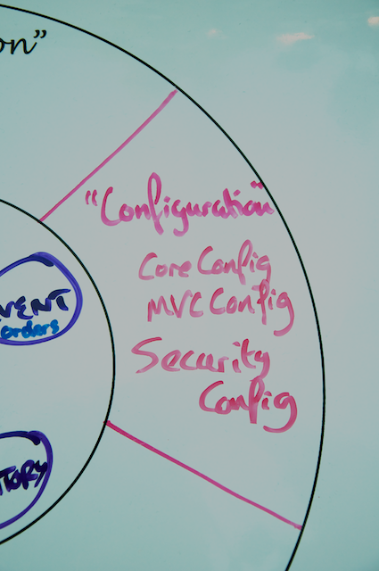

You've set up functionality for the Yummy Noodle Bar RESTful service and your Life Preserver is looking great at this point:


The problem is, at this point the Yummy Nood eBar RESTful service is a little *too* functional: you only want the right clients, the aggregators, to be able to submit and manage orders through the service. 

# Step 5: Securing your Service with Spring Security

Once again, all changes here are limited to the Configuration domain:


## RESTful security basics

To limit access to the Yummy Noodle Bar RESTful service, you extend the initial RESTful design as follows:

* Use HTTP Basic for security credentials.
* Every HTTP Request must supply an Authorization Header with the client's credentials as those won't be stored between requests on the server.
* If a client is not authorized, the service should respond with an HTTP Response that contains a 403 HTTP Status Code http 403.

Spring Security helps you perform these steps, without your having to change so much as a single controller!

## Add Spring Security to your project

First you add Spring Security dependencies to the project, by adding the following entries to your `build.gradle` script:

```groovy
repositories {
    mavenCentral()
    maven { url 'http://repo.springsource.org/milestone/'}
}

dependencies {
    ...
    compile 'org.springframework.security:spring-security-web:3.2.0.M2'
    compile 'org.springframework.security:spring-security-core:3.2.0.M2'
    compile 'org.springframework.security:spring-security-config:3.2.0.M2'
    ...
}    
```

You add the Pivotal milestone repository so that you can use Spring Security 3.2.0.M2. This lets you use some dynamic configuration features of Spring Security, including setting up the web security through JavaConfig.

Now you need to secure your controllers. Until now you've been writing tests first before making any code changes, including configuration. So, instead of immediately adding your security configuration, you'll create a test so that you'll know when your security is being applied correctly.

## Test for security

You already have a functional test from Step 4 that attempts to access your running RESTful service as shown in the code below:

```java
package com.yummynoodlebar.rest.functional;

import com.yummynoodlebar.rest.controller.fixture.RestDataFixture;
import com.yummynoodlebar.rest.domain.Order;
import org.junit.Test;
import org.springframework.http.*;
import org.springframework.web.client.RestTemplate;

import java.util.Arrays;

import static junit.framework.TestCase.assertEquals;
import static junit.framework.TestCase.assertTrue;

public class OrderTests {
    
    @Test
    public void thatOrdersCanBeAddedAndQueried() {
        HttpHeaders headers = new HttpHeaders();
        headers.setContentType(MediaType.APPLICATION_JSON);
        headers.setAccept(Arrays.asList(MediaType.APPLICATION_JSON));
        
        RestTemplate template = new RestTemplate();
        
        HttpEntity<String> requestEntity = new HttpEntity<String>(
        RestDataFixture.standardOrderJSON(),headers);
        
        ResponseEntity<Order> entity = template.postForEntity(
                "http://localhost:8080/aggregators/order",
                requestEntity, Order.class);
        
        String path = entity.getHeaders().getLocation().getPath();
        
        assertEquals(HttpStatus.CREATED, entity.getStatusCode());
        assertTrue(path.startsWith("/aggregators/order/"));
        Order order = entity.getBody();
        
        System.out.println ("The Order ID is " + order.getKey());
        System.out.println ("The Location is " + entity.getHeaders().getLocation());
        
        assertEquals(2, order.getItems().size());
    }
}
```
As HTTP Basic authentication requires you to add some new headers, you'll first extract the creation of those headers for the HTTP request into a separate method called `getHeaders`:

```java   
static HttpHeaders getHeaders() {
    HttpHeaders headers = new HttpHeaders();
    headers.setContentType(MediaType.APPLICATION_JSON);
    headers.setAccept(Arrays.asList(MediaType.APPLICATION_JSON));
    
    return headers;
}
```
Now you can add an Authorization header and capture the value as an argument to the `getHeaders` method to allow you to pass in different security parameters from different test methods:

```java
static HttpHeaders getHeaders(String auth) {
    HttpHeaders headers = new HttpHeaders();
    headers.setContentType(MediaType.APPLICATION_JSON);
    headers.setAccept(Arrays.asList(MediaType.APPLICATION_JSON));

    byte[] encodedAuthorisation = Base64.encode(auth.getBytes());
    headers.add("Authorization", "Basic " + new String(encodedAuthorisation));

    return headers;
}
```

Finally you can update the original test to use the new `getHeaders` helper method to add security headers to your outgoing HTTP request:

```java
@Test
public void thatOrdersCanBeAddedAndQueried() {
    HttpEntity<String> requestEntity = new HttpEntity<String>(
        RestDataFixture.standardOrderJSON(),
        getHeaders("letsnosh" + ":" + "noshing"));
        
    RestTemplate template = new RestTemplate();
    ResponseEntity<Order> entity = template.postForEntity(
    "http://localhost:8080/aggregators/order",
    requestEntity, Order.class);
    
    String path = entity.getHeaders().getLocation().getPath();
    
    assertEquals(HttpStatus.CREATED, entity.getStatusCode());
    assertTrue(path.startsWith("/aggregators/order/"));
    Order order = entity.getBody();
    
    System.out.println ("The Order ID is " + order.getKey());
    System.out.println ("The Location is " + entity.getHeaders().getLocation());
    
    assertEquals(2, order.getItems().size());
}
```

You can do this by creating a request that you know should fail if security is enabled, and check that it does. 

Add in the following test method where you will deliberately corrupt the password to something different to the previous `thatOrdersCanBeAddedAndQueried ` test method so that we can expect this request to fail:

```java
@Test
public void thatOrdersCannotBeAddedAndQueriedWithBadUser() {
    HttpEntity<String> requestEntity = new HttpEntity<String>(
        RestDataFixture.standardOrderJSON(),
        getHeaders("letsnosh" + ":" + "BADPASSWORD"));
    
    RestTemplate template = new RestTemplate();
    ResponseEntity<Order> entity = template.postForEntity(
    "http://localhost:8080/aggregators/order",
    requestEntity, Order.class);
    
    assertEquals(HttpStatus.FORBIDDEN, entity.getStatusCode());
}
```

In this test we're explicitly expecting an HTTP Response that contains an HTTP Status Code of 403 (Forbidden). However if you run this test against your service as it currently stands it will fail as the security credentials are still being ignored.

The full code for your functional test, including security, will now look like the following:

```java
package com.yummynoodlebar.rest.functional;

import com.yummynoodlebar.rest.controller.fixture.RestDataFixture;
import com.yummynoodlebar.rest.domain.Order;
import org.junit.Test;
import org.springframework.http.*;
import org.springframework.security.crypto.codec.Base64;
import org.springframework.web.client.RestTemplate;

import java.util.Arrays;

import static junit.framework.TestCase.assertEquals;
import static junit.framework.TestCase.assertTrue;

public class OrderTests {

    @Test
    public void thatOrdersCanBeAddedAndQueried() {
        
        HttpEntity<String> requestEntity = new HttpEntity<String>(
            RestDataFixture.standardOrderJSON(),
            getHeaders("letsnosh" + ":" + "noshing"));
        
        RestTemplate template = new RestTemplate();
        ResponseEntity<Order> entity = template.postForEntity(
        "http://localhost:8080/aggregators/order",
        requestEntity, Order.class);
        
        String path = entity.getHeaders().getLocation().getPath();
        
        assertEquals(HttpStatus.CREATED, entity.getStatusCode());
        assertTrue(path.startsWith("/aggregators/order/"));
        Order order = entity.getBody();
        
        System.out.println ("The Order ID is " + order.getKey());
        System.out.println ("The Location is " + entity.getHeaders().getLocation());
        
        assertEquals(2, order.getItems().size());
    }
    
    @Test
    public void thatOrdersCannotBeAddedAndQueriedWithBadUser() {
    
        HttpEntity<String> requestEntity = new HttpEntity<String>(
            RestDataFixture.standardOrderJSON(),
            getHeaders("letsnosh" + ":" + "BADPASSWORD"));
        
        RestTemplate template = new RestTemplate();
        ResponseEntity<Order> entity = template.postForEntity(
        "http://localhost:8080/aggregators/order",
        requestEntity, Order.class);
        
        assertEquals(HttpStatus.FORBIDDEN, entity.getStatusCode());
    }
    
    static HttpHeaders getHeaders(String auth) {
        HttpHeaders headers = new HttpHeaders();
        headers.setContentType(MediaType.APPLICATION_JSON);
        headers.setAccept(Arrays.asList(MediaType.APPLICATION_JSON));
        
        byte[] encodedAuthorisation = Base64.encode(auth.getBytes());
        headers.add("Authorization", "Basic " + new String(encodedAuthorisation));
        
        return headers;
    }
}
```


You have your failing test that justifies changing the code in your application. Now it's time to add security to your RESTful service.

## Secure your resources 

You can now add a new concern to your application: security configuration. Create a new Spring configuration in com.yummynoodlebar.config named `SecurityConfig` that contains the following:

```java
import org.springframework.context.annotation.Configuration;
import org.springframework.security.config.annotation.authentication.builders.AuthenticationManagerBuilder;
import org.springframework.security.config.annotation.web.builders.HttpSecurity;
import org.springframework.security.config.annotation.web.configuration.EnableWebSecurity;
import org.springframework.security.config.annotation.web.configuration.WebSecurityConfigurerAdapter;

@EnableWebSecurity
@Configuration
public class SecurityConfig extends WebSecurityConfigurerAdapter {

    @Override
    protected void registerAuthentication(AuthenticationManagerBuilder auth) throws Exception {
        auth.inMemoryAuthentication()
            .withUser("letsnosh").password("noshing").roles("USER");
    }
    
    @Override
    protected void configure(HttpSecurity http) throws Exception {
        http.authorizeUrls()
            .antMatchers("/aggregators/**").hasRole("USER")
            .anyRequest().anonymous()
            .and()
            .httpBasic();
    }
}
```
This configuration enables security using the `@EnableWebSecurity` annotation, and extends the `WebSecurityConfigurerAdapter` so that you can perform more detailed configuration of the web security you're applying.

The `registerAuthentication` method is overridden from `WebSecurityConfigurerAdapter` in order to configure an in-memory database of users that contains a single user, 'letsnosh', with the USER role. 

RESTful services are usually consumed programmatically via clients, such as your test code. It doesn't make much sense to implement a usual challenge+login page system as there is no one to enter the information into the login page if it was actually presented. 

Instead here inside the `configure` overridden method from `WebSecurityConfigurerAdapter` you've configured URL level protection using the `http.authorizeUrls()` method. The `http.authorizeUrls()` method protects the /aggregators/** urls, ensuring that only users with the USER role can access them. This means that access to your RESTful URIs must include an HTTP BASIC Authorization Header, and that any request without this header will be responded to with a 403 (Forbidden) HTTP Status Code.

## Configure the Spring Security filter chain

Spring Security relies on a Servlet filter to apply your security configuration. A filter is used so that security is applied before the Spring MVC Dispatcher Servlet gets involved in processing incoming requests. The Spring Security filter is referred to as the Spring Security filter chain as it actually delegates to a chain of filters internally that each apply one aspect of the security responsibility.

You now need to configure this filter chain by updating the web application configuration you created earlier. Currently this configuration is contained in the `WebAppInitializer` class, and should look like the following:

```java
package com.yummynoodlebar.config;

import org.slf4j.Logger;
import org.slf4j.LoggerFactory;
import org.springframework.web.WebApplicationInitializer;
import org.springframework.web.context.ContextLoaderListener;
import org.springframework.web.context.WebApplicationContext;
import org.springframework.web.context.support.AnnotationConfigWebApplicationContext;
import org.springframework.web.filter.DelegatingFilterProxy;
import org.springframework.web.servlet.DispatcherServlet;

import javax.servlet.FilterRegistration;
import javax.servlet.ServletContext;
import javax.servlet.ServletRegistration;
import java.util.Set;

public class WebAppInitializer implements WebApplicationInitializer {

	private static Logger LOG = LoggerFactory.getLogger(WebAppInitializer.class);

	@Override
	public void onStartup(ServletContext servletContext) {
    	WebApplicationContext rootContext = createRootContext(servletContext);
    
    	configureSpringMvc(servletContext, rootContext);
	}

	private WebApplicationContext createRootContext(ServletContext servletContext) {
    	AnnotationConfigWebApplicationContext rootContext = new AnnotationConfigWebApplicationContext();
    	rootContext.register(CoreConfig.class);
    	rootContext.refresh();
    
    	servletContext.addListener(new ContextLoaderListener(rootContext));
    	servletContext.setInitParameter("defaultHtmlEscape", "true");
    
    	return rootContext;
	}

	private void configureSpringMvc(ServletContext servletContext, WebApplicationContext rootContext) {
    	AnnotationConfigWebApplicationContext mvcContext = new AnnotationConfigWebApplicationContext();
    	mvcContext.register(MVCConfig.class);
    
    	mvcContext.setParent(rootContext);
    
    	ServletRegistration.Dynamic appServlet = servletContext.addServlet(
                "webservice", new DispatcherServlet(mvcContext));
    	       appServlet.setLoadOnStartup(1);
    	Set<String> mappingConflicts = appServlet.addMapping("/");
    
    	if (!mappingConflicts.isEmpty()) {
      	for (String s : mappingConflicts) {
        	LOG.error("Mapping conflict: " + s);
      	}
      	throw new IllegalStateException(
          "'webservice' cannot be mapped to '/'");
    	}
	}
}
```

The first step is to simply add your new `SecurityConfig` JavaConfig class to the root context:

```java
rootContext.register(CoreConfig.class, SecurityConfig.class);
```

Now you can add the Spring Security Filter:
```java
private void configureSpringSecurity(ServletContext servletContext, WebApplicationContext rootContext) {
    FilterRegistration.Dynamic springSecurity = 
            servletContext.addFilter("springSecurityFilterChain", 
                    new DelegatingFilterProxy("springSecurityFilterChain", rootContext));
    springSecurity.addMappingForUrlPatterns(null, true, "/*");
}
```

This sets up a Spring `DelegatingFilterProxy` with the `rootContext`. 

The name `springSecurityFilterChain` for the filter chain is important as this means that the filter will pass all calls down to a Spring Bean named `springSecurityFilterChain` that it finds in the `rootContext`. You configured this bean using `@Configuration` in the Spring JavaConfig class `SecurityConfig`.

## Run your new secure RESTful service

Run your RESTful service again:

	> ./gradlew tomcatRunWar

Then run your amended tests in the `OrderTests` class again. Everything should pass and so now you've added security to your RESTful service!

## Summary

You've extended your Configuration domain to secure your RESTful service as shown in the updated life preserver:



Now that you have a secure RESTful service that allows you to access data in your chosen format, it's time to think about *discovery*.

How does a client go about discovering what resources you're making available from your RESTful service, and what can be done with those resources? Without having to communicate all of that information up front and set it in stone for all of eternity?

It's time for you to implement a technology known by the worst acronym in the history of the web: it's time to implement HATEOAS.

[Next… Make your Service Discoverable with Spring HATEOAS](../6/)
