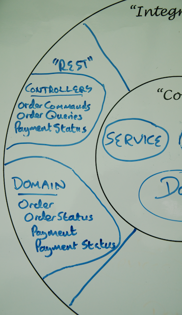

[HATEOAS (Hypermedia As The Engine of Application State)][gs-rest-hateoas] may be an unfortunate acronym, but it is also a crucial technology and approach to building flexible RESTful services. HATEOS allows you to build services that *support the discovery of resources* and provide a standard way to implement the linking of resources together that is an essential part of hypertext systems.

## Step 6: Make your service discoverable with Spring HATEOAS

HATEOAS provides a consistent mechanism for you to describe what resources you have and what resources relate to them. A client that understands HATEOS and its corresponding links can effectively discover and react to what resources are supported at a given moment in time *without having to agree to this all up front*.

Building a REST service is all about creating resources, representing them to clients, and providing consistent locations at which the resources are accessed.  Of course, many of your resources will be related.  For Yummy Noodle Bar, an Order resource has related Status and Payment Detail resources.  In advance, you could tell the developers of the clients that the URI of the status is `/orders/{id}/status`.   

What if you didn't have to do this, and could instead embed the location of the status within the Order resource itself? This is the natural way that hypertext systems work, and HTTP is no exception.  It naturally deals in URLs, and the most native system delivered over HTTP, HTML, has linking deeply integrated.  

How do you build a RESTful service to include links between your resources?

Enter [HATEOAS][u-hateoas].  

HATEOAS adds support to be able to turn this:

```json
{ 
    "name": "Derek",
    "age": 15
}
```
into this:

```json
{
    "name": "Derek",
    "age": 15,
    
    "links" : [ 
        { "rel" : "self", "href" : "http://myhost/people/derek" },
        { "rel" : "Mother", "href" : "http://myhost/people/shirley" },
        { "rel" : "Father", "href" : "http://myhost/people/brad" }
    ]
}
```

To make this work, you need to introduce into your resource representations the concept of links that follow a specification and are automatically discoverable by a client that understands HATEOAS.

### Implement HATEOAS for Yummy Noodle Bar with Spring HATEOAS

Import Spring HATEOAS into your project by updating `build.gradle`'s dependency list with this:

    <@snippet "build.gradle" "hateoas" "/complete" />

### Create a (failing) test for HATEOAS

Continuing the practice of creating a test before altering the codebase, add the following into your `OrdersTest` test class.

    <@snippet "src/test/java/com/yummynoodlebar/rest/functional/OrderTests.java" "thatOrdersHaveCorrectHateoasLinks" "/complete" />
    
This code will not compile yet because the `Order` class in the RESTful Domain doesn't have a `getLink()` method yet.

The full test class will now look like the following:

    <@snippet path="src/test/java/com/yummynoodlebar/rest/functional/OrderTests.java" prefix="complete" />
    
As just stated, this code will not compile yet as the `Order` class in the RESTful Domain doesn't yet have a `getLink()` method.

To rectify this, but still leave a failing test, update `Order` to read:

    <@snippet "src/main/java/com/yummynoodlebar/rest/domain/Order.java" "import" "/complete" />

    <@snippet "src/main/java/com/yummynoodlebar/rest/domain/Order.java" "resourceSupport" "/complete" />

Extending `ResourceSupport` from Spring HATEOAS lets your test compile, but it will still fail if you run it, because the links generated will be empty.

You also need to update a test written previously `com.yummynoodlebar.rest.domain.OrderTests`.  Spring Hateoas can only be used during a servlet request, and requires some set up in a test.

Update `com.yummynoodlebar.rest.domain.OrderTests` to include 

    <@snippet "src/test/java/com/yummynoodlebar/rest/domain/OrderTests.java" "supportHateoas" "/complete" />

## Implement HATEOAS for your RESTful domain classes

It's time to tell your RESTful domain classes, in particular the `Order` class, how to generate links in their representations.

To add your first link using Spring HATEOAS, add this to `fromOrderDetails()`:

    <@snippet "src/main/java/com/yummynoodlebar/rest/domain/Order.java" "selfRel" "/complete" />
    
You define where the link is going, in this case to the OrderQueriesController, followed by an ID for the template, which is UUID in this case.  

The ID is required for the generated link to be able to provide the parameters needed for the template URI that you on OrderQueriesController earlier to map the URI to OrderQueriesController.viewOrder().

The `withSelfRel()` indicates that this is the definitive URI for this resource, a self-reference. This is most useful if you store a resource without its url and want to reference it again later, or if you have just created a new resource and want to navigate to its location.  In the second case, the Location header should also be available.

To add links that are not self referencing, the syntax is:

    <@snippet "src/main/java/com/yummynoodlebar/rest/domain/Order.java" "status" "/complete" />

This creates an explicit relation link, that of 'Order Status' that can then be queried for by a client.

In the life preserver model, the `rest.domain.Order` class is the focus for all view and representation concerns that relate the to Order Resources. So it is the rest.domain.Order class that is the natural place to embed the generation of links into that class. 



Now it's time for you to extend the `rest.domain.Order` class to include all links:

    <@snippet "src/main/java/com/yummynoodlebar/rest/domain/Order.java" "fromOrderDetails" "/complete" />
    
If you run the test suite by itself, it will fail:

```sh
$ cd 6/complete
$ ./gradlew test

… test failure...
```

That's because you need to be running the web application first. Run your RESTful service again, but with hypermedia features added:

```sh
$ ./gradlew tomcatRunWar
```

Then run your amended tests in the `OrderTests` class again, in another shell. 
```sh
$ ./gradlew test
```

You should find that it passes, meaning that the JSON contains the appropriate links and you've successfully implemented HATEOAS for your RESTful Service!

## Summary

Adding HATEOAS so that your RESTful resources, the actions you can perform upon them and the relationships between them is not mandatory for all RESTful services. But doing so certainly increases the flexibility of your RESTful service to change if you do implement it.

Here you've learned the basics of applying Spring HATEOAS to extending your RESTful domain's resource components to apply links to the generation of the representations of those components.

Now it's time for a coffee and a wrap-up as you've got a complete RESTful service ready to go. Yummy Noodle Bar could not be happier!

[Next… Recap and What's Next](../7/)

[gs-rest-hateoas]: /guides/gs/rest-hateoas
<@u_hateoas/>