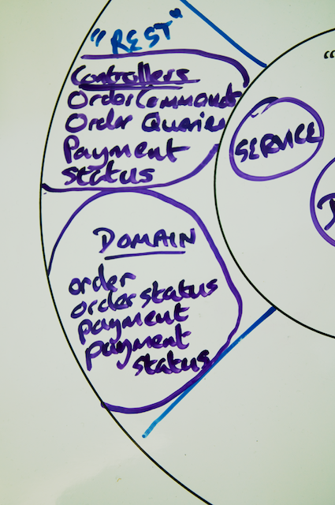

## Step 6: Make your Service Discoverable using Spring HATEOAS

HATEOAS, Hypermedia As The Engine of Application State, may be one of the worst acronyms you may come across, but it is also a crucial technology and approach to building flexible RESTful services.

HATEOS allows you to build services that *support the discovery of resources* and re-introduce the linking of resources together that is an essential part of hypertext systems.

HATEOS provides a consistent mechanism for you to describe what resources you have and what resources relate to them. A client that understands HATEOS and its corresponding links will be able to effectively discover and react to what resources are supported at a given moment in time *without having to agree this all up front*.

### Resources and Linking them together

Building a REST service is all about creating resources, representing them to clients and providing consistent locations for them to be accessed at.  Naturally, many of your resources will be related together.  For Yummy Noodle Bar, an Order resource has a related Status and Payment Detail resources.  In advance, we could tell the developers of the clients that the uri of the status was `/orders/{id}/status`.   

What if we didn't have to do this?  If we would embed the location of the status within the Order resource itself.  
This is the natural way that hypertext systems work, and HTTP is no exception.  It naturally deals in URLs, and the most native system delivered over HTTP, HTML, has linking deeply integrated.  This is the way that the web works. 

If we want to build RESTful services including links between our resources would seem to be a good thing.

How can we do this?

Enter HATEOAS.  

In short, this adds support to be able to turn this:

    { 
        "name": "Derek",
        "age": 15
    }
    
into this:

    {
        "name": "Derek",
        "age": 15
        
        links : [ 
            { rel : "self", href : "http://myhost/people/derek" },
            { rel : "Mother", href : "http://myhost/people/shirley" },
            { rel : "Father", href : "http://myhost/people/brad" }
        ]
    }

In order to make this work, you will need to introduce the concept of links into your resource representations that follow a specification and are automatically discoverable by a client that understands HATEOAS.

### Implementing HATEOAS for Yummy Noodle Bar using Spring HATEOAS

First you need to import Spring HATEOAS into your project by updating `build.gradle` with the following:

```groovy
dependencies {
    ...
    compile 'org.springframework.hateoas:spring-hateoas:0.7.0.RELEASE'
    ...
}
```

### Creating a (Failing) Test for HATEOAS

Following our practice so far of creating a test before altering the codebase add the into your `OrdersTest` test class.

```java
@Test
public void thatOrdersHaveCorrectHateoasLinks() {

    ResponseEntity<Order> entity = ...
    
    Order order = entity.getBody();
    
    String orderBase = "/aggregators/order/" + order.getKey();
    
    assertEquals(entity.getHeaders().getLocation().toString(), order.getLink("self").getHref());
    assertTrue(order.getLink("Order Status").getHref().endsWith(orderBase + "/status"));
}
```
    
This code will not compile yet as the `Order` class in the RESTful Domain doesn't yet have a `getLink()` method.

The full test class will now look like the following:

```java
package com.yummynoodlebar.rest.functional;

import com.yummynoodlebar.rest.controller.fixture.RestDataFixture;
import com.yummynoodlebar.rest.domain.Order;
import com.yummynoodlebar.rest.domain.OrderStatus;
import org.junit.Test;
import org.springframework.http.*;
import org.springframework.security.crypto.codec.Base64;
import org.springframework.web.client.RestTemplate;

import java.util.Arrays;

import static junit.framework.TestCase.assertEquals;
import static junit.framework.TestCase.assertTrue;

public class OrderTests {

    @Test
    public void thatOrdersCanBeAddedAndQueried() {
    
        ResponseEntity<Order> entity = createOrder();
        
        String path = entity.getHeaders().getLocation().getPath();
        
        assertEquals(HttpStatus.CREATED, entity.getStatusCode());
        assertTrue(path.startsWith("/aggregators/order/"));
        Order order = entity.getBody();
        
        System.out.println ("The Order ID is " + order.getKey());
        System.out.println ("The Location is " + entity.getHeaders().getLocation());
        
        assertEquals(2, order.getItems().size());
    }
    
    @Test
    public void thatOrdersHaveCorrectHateoasLinks() {
    
        ResponseEntity<Order> entity = createOrder();
        
        Order order = entity.getBody();
        
        String orderBase = "/aggregators/order/" + order.getKey();
        
        assertEquals(entity.getHeaders().getLocation().toString(), order.getLink("self").getHref());
        assertTrue(order.getLink("Order Status").getHref().endsWith(orderBase + "/status"));
    }
    
    @Test
    public void thatNewOrderHasOrdersStatusCreated() {
    
        ResponseEntity<Order> entity = createOrder();
        
        Order order = entity.getBody();
        
        HttpEntity<String> requestEntity = new HttpEntity<String>(
            RestDataFixture.standardOrderJSON(),getHeaders());
        
        RestTemplate template = new RestTemplate();
        
        ResponseEntity<OrderStatus> response = template.exchange(
            order.getLink("Order Status").getHref(),
            HttpMethod.GET,
            requestEntity, OrderStatus.class);
        
        assertEquals(HttpStatus.OK, response.getStatusCode());
        assertEquals("Order Created", response.getBody().getStatus());
    }
    
    private ResponseEntity<Order> createOrder() {
        HttpEntity<String> requestEntity = new HttpEntity<String>(
            RestDataFixture.standardOrderJSON(),getHeaders());
        
        RestTemplate template = new RestTemplate();
        return template.postForEntity(
            "http://localhost:8080/aggregators/order",
            requestEntity, Order.class);
    }
    
    static HttpHeaders getHeaders() {
        HttpHeaders headers = new HttpHeaders();
        headers.setContentType(MediaType.APPLICATION_JSON);
        headers.setAccept(Arrays.asList(MediaType.APPLICATION_JSON));
        
        String authorisation = "letsnosh" + ":" + "noshing";
        byte[] encodedAuthorisation = Base64.encode(authorisation.getBytes());
        headers.add("Authorization", "Basic " + new String(encodedAuthorisation));
        
        return headers;
    }

}
```

This test will now not compile.

To rectify this, but still leave a failing test, update `rest.domain.Order` to read 

```java
..
import org.springframework.hateoas.ResourceSupport;

public class Order extends ResourceSupport implements Serializable {
...
```

By extending `ResourceSupport` from Spring HATEOAS your test will now compile but it will still fail if you run it as the links generated will be empty.

## Implementing HATEOAS on your RESTful Domain Classes

It's time to tell your RESTful domain classes, in particular here the `Order` class, how to generate links in their representations.

To add a link using Spring Hateoas you do the following:
```java
order.add(linkTo(OrderQueriesController.class).slash(key).withSelfRel());
```
Firstly you define where the link is going, in this case to the OrderQueriesController, followed by an ID for the template, which is UUID in this case.  

The ID is required in order for the generated link to be able to provide the parameters needed for the template URI that you on OrderQueriesController earlier to map the URI to OrderQueriesController.viewOrder().

The `withSelfRel()` indicates that this is the definitive URI for this Resource, a self reference. This is most useful if you store a Resource without its url and want to reference it again later, or if you have just created a new Resource and want to navigate to its location.  In the second case, the Location header should also be available.

To add links that are not self referencing, the syntax is:
```java
order.add(linkTo(OrderStatusController.class).slash(key).slash("status").withRel("Order Status"));
```

This creates an explicit relation link, that of 'Order Status' that can then be queried for by a client.

In the Life Preserver model we have been using, the `rest.domain.Order` class is the focus for all view and representation concerns that relate the to Order Resources. So it is the rest.domain.Order class that is the natural place to embed the generation of links into that class. 



Now it's time for you to extend the `rest.domain.Order` class to include link generation by adding then following:
```java
public static Order fromOrderDetails(OrderDetails orderDetails) {
    Order order = new Order();
    
    order.dateTimeOfSubmission = orderDetails.getDateTimeOfSubmission();
    order.key = orderDetails.getKey();
    order.setItems(orderDetails.getOrderItems());
    
    order.add(linkTo(OrderController.class).slash(order.key).withSelfRel());
    order.add(linkTo(OrderController.class).slash(order.key).slash("status").withRel("Order Status"));
    order.add(linkTo(OrderController.class).slash(order.key).slash("paymentdetails").withRel("Payment Details"));
    
    return order;
}
```

Run up the application using `./gradlew tomcatRunWar` and the run `OrderTests` again and now you should find that it passes, meaning that the JSON contains the appropriate links and you've successfully implemented HATEOAS for your RESTful Service!

## Summary

Adding HATEOAS so that your RESTful resources, the actions you can perform upon them and the relationships between them is not mandatory for all RESTful services, but it certainly increases the flexibility of your RESTful service to change if you do implement it.

Here you've learned the basics of applying Spring HATEOAS to extending your RESTful Domain's resource components to apply links to the generation of the representations of those components.

Now it's time for a coffee and a wrap-up as you've now got a complete RESTful service ready to go and Yummy Noodle Bar could not be happier!

[Next… Recap and Where to go Next](../7/)