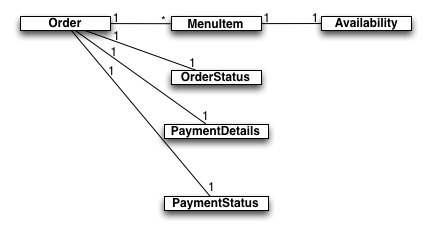

# Designing and Implementing RESTful Web Services with Spring

## Why RESTful Services?

RESTful Web Services are everywhere these days. From integrating with [Amazon Web Services](http://aws.amazon.com) to syndicating multiple feeds of data, RESTful Web Services that follow the guidelines of [Roy Fielding's architectural style](http://www.ics.uci.edu/~fielding/pubs/dissertation/top.htm) are successfully providing simple and effective web APIs that are scalable and performant from a few to a few million users and more.

Since you're reading this tutorial, it's likely that you're considering implementing a RESTful web service because:

* You're creating an API that clients will need to consume across the Web
* You want to open up your organisations data to consumption by varied clients across the web.
* You need to integrate your application with other applications inside your own organisation, but you don't have control over the languages, tools or frameworks that those other applications are likely to be written in.

Or maybe you're just curious to see what a RESTful web service implemented using Spring looks like. Whatever your reason, in this tutorial you're going to take a deep dive into building a production-strength RESTful we service and so if that's your goal, you've come to the right place. 

## What you'll need

To work through this tutorial you'll need a few things:

* About an hour of your time to complete the tutorial.
* An installation of the [Gradle](http://www.gradle.org) build tool, version 1.6 or above.
* A copy of the code (TODO - downloadable as Zip and/or git clone).
* An IDE of your choice; we recommend [SpringSource Tool Suite](http://www.springsource.org/sts) which is available as a [free download](http://www.springsource.org/sts).

## The Home of RESTful Services in your Application's Architecture

TBD Where RESTful services sit in the Life Preserver diagram to be added.

RESTful services are an integration between your application and the myriad of possible clients that need to consume your services. As such, RESTful services can be seen as living in their own integration domain on the periphery of your application's core as shown in the above diagram [1]. 

As an integration between your application and the outside world, there are a number of concerns that need to be addressed in the design and implementation of the components that make up your RESTful services:

* Your RESTful service component's primary purpose implement the necessary functionality for the specific RESTful service you are exposing, and are not necessarily a one-to-one exposure of the internals of your application.
* The components that make up your RESTful services components will need to evolve at a rate that is appropriate for the many consumers that are relying on your services.
* Your RESTful service components should not contain any of the core logic to your application but will collaborate with other components in the Core domains of your application in order to orchestrate the necessary functionality to provide the service interface.

That's enough on the design constraints placed on the components that implement your RESTful services, let's now look at how to implement those components using Spring.

## Yummy Noodle Bar is going Global
TODO Drop in real image of front of Yummy Noodle Bar restaurant

Yummy Noodle Bar wants to provide a RESTful web service to a set of aggregators that want to submit orders, in particular “Let’s Nosh” who are a massive brand of aggregator that will potentially bring in big business to the small-scale noodle bar.

You are given the task of helping Yummy Noodle Bar to extend the successful Yummy Noodle Bar internal application to create a new public Web API for submitting, tracking, cancelling and amending orders.

## Modelling RESTful Service Domain

TODO Zoomed in on the core components of the system in the Life Preserver.

Currently the core, application internal domain of the Yummy Noodle Bar is made up of the following components:

* Orders
The collection of all orders currently in the system, regardless of status. In the terminology of [Domain Driven Design](http://en.wikipedia.org/wiki/Domain-driven_design), Orders is an Aggregate Root that ensures consistency across all of the Orders in the system.
* Order
An individual order in the system that has an associated status and status history for tracking purposes.
* OrderStatus
The current allocated status to an order.
* OrderStatusHistory
Associated with an order, this is an ordered collection of the previous status' that the order has transitioned through.
* PaymentDetails
* PaymentStatus
* Menu
* MenuItem
* Availability

Focussing primarily on Orders, these can be acted upon by a number of events:
* OrderCreatedEvent
Creates a new order for a number of menu-items.
* OrderUpdatedEvent
Updates an existing Order with some additional information, possibly payment information.
* OrderDeletedEvent
Deletes an existing order if it is not being cooked.
* RequestAllCurrentOrdersEvent
Requests the full list of all current orders be returned.

## Modelling the RESTful Service Domain

For the first version of your new Yummy Noodle Bar RESTful service, the ability to create, update and remove Orders is the focus.

It can be tempting to simply expose the core Order domain to the outside world and work from there, but that would ignore the boundary between the Core and the RESTful service domain (TODO highlight this boundary on a focus on the Life Preserver).

The public API of your service that you are going to expose to the aggregators will need to change at a rate that is friendly to those clients, and the core will need to evolve at whatever rate the Yummy Noodle bar system need to internally evolve at. So there is potentially friction between the two domains as they may need to evolve at different rates.

To manage this friction you need to create concepts and components in the RESTful Service domain that are unique to, and can evolve at the rate needed by, the RESTful domain itself. This may result in similar types of components but since their purpose will be very different the similarities are superficial.

## Modelling the Orders and Order Resources

There are three stages to modelling your RESTful Service domain, they are:

* Designing your Resources - What resources you need to expose to the outside world
* Designing your URIs - How your resources will be publicly addressed
* Adding the verbs - what operations can you perform on your RESTfully exposed resources

### Designing your Resources

When looking for the resources that you are going to support through your RESTful Service the first step is to look for the relevant nouns in your domain. In the case of the Yummy Noodle Bar, the following nouns are candidates from the domain we currently understand it:

* Order
* OrderStatus
* OrderStatusHistory
* PaymentDetails
* PaymentStatus
* Menu
* MenuItem
* Availability

The purpose of the Yummy Noodle Restful Service is to allow aggregators and partners to submit and track orders as they are executed and delivered from the Yummy Noodle Bar. To do this a subset of the available domain concepts make up your initial cut of the resources you are going to expose:

* Order
* MenuItem
* Availability
* OrderStatus
* PaymentDetails
* PaymentStatus

The following diagram shows these resources and the relationships between them.

### Designing your URIs

Each resource needs to be addressable using a URI. In addition, the address implies the relationship between each of the resources.

For your Yummy Noodle Bar RESTful Service domain, the resources will have the following URIs:

* All Orders

    URI Template: 

    http://www.yummynoodlebar.com/aggregators/orders

* An Order
    URI Template: 
    http://www.yummynoodlebar.com/aggregators/orders/{Order ID}
* All MenuItems
URI Template: 
http://www.yummynoodlebar.com/aggregators/menuitems
* A specific MenuItem
URI Template: 
http://www.yummynoodlebar.com/aggregators/menuitems/{MenuItem ID}
* All MenuItems associated with an Order
** URI Template: 
http://www.yummynoodlebar.com/aggregators/orders/{Order ID}/menuitems
* A specific MenuItem associated with an Order
URI Template: 
http://www.yummynoodlebar.com/aggregators/orders/{Order ID}/menuitems/{MenuItem ID}
* The current OrderStatus
http://www.yummynoodlebar.com/aggregators/orders/{Order ID}/status
* The PaymentDetails for an Order
http://www.yummynoodlebar.com/aggregators/orders/{Order ID}/paymentdetails
* PaymentStatus
http://www.yummynoodlebar.com/aggregators/orders/{Order ID}/paymentstatus

Each of the above URI's are expressed as *templates*; they contain blocks in the address, demarcated with {}. Since the URI in a RESTful service should completely address the resource, without any additional query parameters, then there will be parts of the URI that are specific to the resource itself. An example would be 

Here we've used the {} notation to specify where part of the URL will be unique when identifying specific resources. As an example, an Order with Order ID of 1 would have the following specific URL once the URI template is furnished with the Order Number:

    http://www.yummynoodlebar.com/aggregators/orders/1

An Order with an Order ID of 37 would have the following specific URI:

    http://www.yummynoodlebar.com/aggregators/orders/37

This quality of the URI changing to work with specific resources is what gives a resource the quality of being *addressable*.

### Adding the verbs

To be included.

## Step 1: Building Your First RESTful Service
TBD Modelling your domain as RESTful concepts.

## Step 2: Deploying your Service

## Step 3: Testing your Service using RESTTemplate

## Step 4: Securing your Service

## Step 5: Make your Service Discoverable using Spring HATEOAS

HATEOS, Hypermedia As The Engine of Application State, may be one of the worst acronyms but it is also a crucial technology and approach to building flexible RESTful services.

HATEOS allows you to build services that *support the discovery of resources* and then the *discovery of what can be done to those resources*.

From our example, you can see what HATEOS enables by appending out interaction as defined using HTTP verbs with the word "Discover". Beforehand our interaction was described as:

* See all the Orders by sending a GET request to the Orders URI
* Cancel all the Orders by sending a DELETE request to the Orders URI
* Create a new Order by sending a POST request to the Orders URI
* Show the details of an existing order by sending a GET request to a specific Order's URI
* Update an Order by sending a PUT request to a specific Order's URI
* See an Order's status by sending a GET request to an Order's Status URI
* Cancel an Order by sending a DELETE request to a specific Order's URI

HATEOS allows a client to:
* *Discover* that they can see all the Orders by sending a GET request to the Orders URI
* *Discover* that they can cancel all the Orders by sending a DELETE request to the Orders URI
* *Discover* that they can create a new Order by sending a POST request to the Orders URI 
* *Discover* that they can show the details of an existing order by sending a GET request to a specific Order's URI
* *Discover* that they can update an Order by sending a PUT request to a specific Order's URI
* *Discover* that they can see an Order's status by sending a GET request to an Order's Status URI
* *Discover* that they can cancel an Order by sending a DELETE request to a specific Order's URI

HATEOS provides a consistent mechanism for you to describe what resources you have and what can be done with those resources. A client that understands HATEOS and its corresponding links will be able to effectively discover and react to what resources and actions on those resources are supported at a given moment in time *without having to agree this all up front*.

### Simplifying JSON and XML representation generation

### Using Link and LinkDiscoverer to discover Resources

### Simplifying URI Generation using ControllerLinkBuilder

TBD Implementing Hypermedia links to give hints as to how your resources can be interacted with.
TBD Testing for Hypermedia links using REST Template.

## Recap and Where to go Next?

