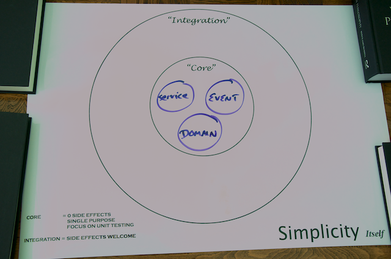
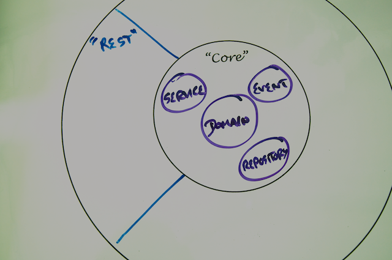

In this tutorial you'll use Spring to create a production-strength RESTful web service. 

## Why RESTful web services?

From integrating with [Amazon Web Services](http://aws.amazon.com) to syndicating multiple feeds of data, RESTful web services that follow the guidelines of [Roy Fielding's architectural style](http://www.ics.uci.edu/~fielding/pubs/dissertation/top.htm) provide simple, effective web APIs that scale from a few users to millions.

It's likely that you want to implement a RESTful web service because:

* You're creating an API that clients need to consume across the web.
* You want to open up your organization's data to consumption by varied clients across the web.
* You need to integrate your application with other applications inside your own organization, but you don't have control over the languages, tools, or frameworks for those applications.

Or maybe you're just curious to see what a Spring-implemented RESTful web service looks like. Whatever your reason, you've come to the right place.

## What you'll build

**Yummy Noodle Bar** is going global. It wants to provide a RESTful web service to a set of aggregators, in particular **Let’s Nosh**, a popular restaurant directory that will bring big business to the small-scale noodle bar. You'll extend Yummy Noodle Bar's internal application by creating a new public Web API for submitting, tracking, canceling, and amending orders.


## What you'll need

* About thirty minutes for each section. You should be able to comfortably work your way through the entire tutorial during your lunch break in a week (or do it all on the weekend!)
* An installation of the [Gradle](http://www.gradle.org) build tool, version 1.6 or later.
* A copy of the code (available either by [git][u-git] or a [downloadable zip file](https://github.com/spring-guides/tut-rest/archive/master.zip)).
* An IDE of your choice; Spring recommends [Spring Tool Suite](http://www.springsource.org/sts), which is a [free download](http://www.springsource.org/sts).

### Downloading and running the code

If you download the code base, you'll discover each section of this tutorial in a separate folder, numbered 1, 2, 3, etc. There are also several code drops: an **initial** one at the root, and a separate **complete** code drop for each section.

The **initial** code set contains:
- a project layout
- the core domain & event classes this tutorial starts off creating (the 'Yummy Noodle Bar Application', above)
- some basic unit tests for some of those classes

The **complete** code set in each section includes the initial code base plus the code developed up to that point in the tutorial.

You can choose to start with the **initial** code set. Or you can start with the **complete** code set for a given section. Not every code file is displayed in the tutorial, because that would slow things down too much. But important ones are such as writing tests, creating RESTful services, and looking at some key domain objects

While there are many build systems, this tutorial is built using [Gradle][gs-gradle] and includes the Gradle Wrapper, so if you grab a copy of the code (as shown below) you don't have to install anything to run the code.

For example, if you want to inspect the initial code set, do this:

```sh
$ git clone git@github.com:spring-guides/tut-rest.git
$ cd tut-rest/initial
$ ./gradlew clean test
```

From there, you can review `build/reports/tests` and see all the test results.

If you want to switch to section 6, the last part of this tutorial, and run the web application and it's tests do this:

```sh
$ cd ../6/complete
$ ./gradlew tomcatRunWar
```

In a separate console:

```sh
$ ./gradlew test
```

Some of the sections don't require running the web application to execute the tests.

[u-git]: /understanding/Git
[gs-gradle]: /guides/gs/gradle

## Yummy Noodle Bar application architecture and the Core domain

The current architecture of the application is shown in the following "Life Preserver" diagram:



The Life Preserver diagram is a tool for building applications that following the principles of the [Hexagonal Architecture, sometimes referred to as 'Ports and Adapters' originally characterised by Alistair Cockburn](http://alistair.cockburn.us/Hexagonal+architecture). The Life Preserver diagram shows your application's core internal domains along with the surrounding 'integration' domains that map directly to the packages and components that you'll be working on throughout this tutorial, so it's a great way to understand where things are.

Open the Initial project and you'll see that the life preserver diagram maps to the different packages under `src/main/java/com/yummynoodlebar`.

Under the core application's top-level packages, `com.yummynoodlebar.core`, here's what the packages contain:

* **domain**. Components that cleanly capture the application's Core domain concepts. These classes are a manifestation of the [ubiquitous language](http://martinfowler.com/bliki/UbiquitousLanguage.html) of the Core domain.
* **repository**. Components that store and retrieve the current state of the system's domain objects.
* **event**. Components that are the events that the domain can receive and process.
* **service**. Components that handle the actions that can be performed when an event is received.

Take a moment to familiarize yourself with the components in each package. The tests for the core domain components are available in the src/test area in the `initial` project. They will give you an idea of how these components will be used.

## RESTful web services domain

RESTful web services integrate your application and the all of the possible clients that need to consume your services. As such, RESTful services live in their own integration domain, outside your application's core, as shown in the following update to your life preserver.



Given the integration between your application and the outside world, consider the following design and implementation constraints:

* Your RESTful service API is your focus; the core application structure should not influence the design of the API.
* The components that make up your RESTful services need to evolve at a rate that is appropriate for the many consumers that rely on your services.
* Your RESTful service components should not contain any core logic for your application, but they will collaborate with other components in the Core domains of your application in order to orchestrate the necessary functionality for the service interface.

## Tutorial road map

* [Step 1: Modeling the Core and RESTful Web Service Domains](1/)
* [Step 2: Building Your First RESTful Web Service](2/)
* [Step 3: Wiring Up and Deploying your Service](3/)
* [Step 4: Testing Your Service with Spring's REStTemplate](4/)
* [Step 5: Securing Your Service with Spring Security](5/)
* [Step 6: Making your Service Discoverable with Spring HATEOAS](6/)
* [Recap and What's Next?](7/)


